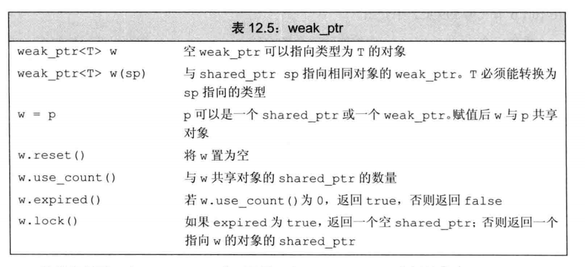

# 输入输出流

## rdbuf

```c++
#include <cstring>
#include <iostream>
#include <fstream>
#include <sstream>
using namespace std;
 
//****************个人对流操作中<<和>>符号的理解********************
//
///     可以这么认为:可以根据<< 或 >>箭头的方向来理解流的过程.
///  比如:cout<<n; 由于<<箭头方向向左,所以意思就是将n的值流入cout
///  cout是标准输出流,所以cout<<n;就把n显示到了屏幕上.
///  对于cin>>n;来说由于>>箭头方向向右,所以意思就是将cin中的数据
///  流入n变量,cin是标准输入流,所以cin>>n;就把屏幕上的数据写入n
///  变量.也就是说箭头的方向相当于流的方向,也就是数据的流向.对于其他
///  流对象(xxxstream)也是一样的道理.
//
 
//
///                C++流对象函数rdbuf()简介:
///    rdbuf()可以实现一个流对象指向的内容用另一个流对象来输出,比如想把
///  一个文件的内容输出到显示器上,我们可以两行代码完成:
///  ifstream infile("test.txt");
///  cout << infile.rdbuf();
//
#if 0
int main()
{
	ifstream infile("test.txt");
    cout << infile.rdbuf();  //把infile流对象中的流重定向到标准输出cout上
	return 0;
}
#endif
//
///     一个简单的文件复制示例,简化了C语言繁琐的操作(循环读取)
//
#if 1
int main()
{
    fstream infile("test.txt", ios::in);
	if (!infile.is_open())
	{
        cout << "源文件打开失败..." << endl;
	    return -1;
	}
    fstream outfile("test.bak.txt", ios::out);
	if (!outfile.is_open())
	{
		cout << "目标文件打开失败..." << endl;
		return -1;
	}
	outfile<<infile.rdbuf();  //将infile流中的数据传入outfile流中
	infile.close();
	outfile.close();
	return 0;
}
#endif
```

## 输出转义字符

```
cout<<"\x4dO\115\n";
\x4d 表示16进制4d
\115 表示8进制，\后面只能有最多3位8进制数，例如\1234表示\123代表的字符和字符'4'；
```

## C++11初始化注意点

C++可以使用花括号初始化，这种初始化形式被称为列表初始化

```c++
int a=0;
int a={0};
int a(0);
int a{0};

long double ld=3.1415926536;
int a{ld},b={ld};//错误，因为列表初始化丢失信息编译器会报错。
int c(ld),d=ld;//正确，能转换执行，但是也丢失了信息。
```

# C++易忘点

## 引用和指针

* 引用必须被初始化。引用只是给已经存在的一个变量一个别名。
* 一旦定义了引用，就无法令其再绑定到另外的对象，因为之后每一次使用都是访问最初绑定的对象，引用没有实际的空间，只是一个别名。

## 常量表达式和constexpr变量

* 常量表达式指的是不会改变，并且在编译过程就能得到的计算结果的表达式。
* 很难判别一个值是不是常量表达式，C++11允许使用constexpr类型变量，以便编译器来验证变量值是否是一个常量表达式。
* constexpr指针初始值为nullptr或者是存储于某个固定地址中的对象。并且constexpr限定符只对该指针有效，与指针所指向的对象无关。

## 类型别名

```
using SI=Sales_item;//c++11
typedef Sales_item SI;
```

可以使用上述两种方式使用别名。

## declype

declype获取表达式的类型

## string的相关函数

```
string s1;
cin>>s1;//会自动忽略开头的空白（空格、换行、制表符），从第一个真正字符开始到第一个空白结束
getline(cin,s1);读取一行，直到遇到换行符为止，换行符也被读取，但是没有加入到s1中，实际上换行符被丢弃了。
string::size_type   string::size()函数返回的是size_type类型，是一个无符号类型。
string比较规则:1.长度不同则长度较小的更小，2.第一个不同字符的字典序小的较小。
string+string时候 必须保证有一个string不是字面值，即string s="hello"+",";	这是是非法的。
同时字符串的字面值并不是string类型，切记！

```

## cctype

* cctype头文件中有一些函数能够判断字符c是什么类型。

  ```
  isalnum
  isalpha
  iscntrl
  isdigit
  isgraph
  islower
  isprint
  ispunct
  isspace
  isupper
  isxdigit
  tolower
  toupper
  ```


## size()类型

```
vector<int> ::size_type  i=0;


vector<int> s;
decltype(s.size()) i=0;
尽量用上述两种办法定义下标
```

## stable_partition()和partition

stable_partition和partition对指定容器进行分组

```
stable_partition(v.begin(),v.end(),[&](const int a)
{
	return a!=0;//判断条件，符合的放前面，不符合的放后面
});
partition和stable_partition的不同之处在于partition不保证相对位置，但是stable_partition保证了相对位置。
```

## 数组的begin和end

标准库函数中有begin函数和end函数，类似vector中的begin和end迭代器。

```c++
#include<iterator>
int ia[]={0,1,2,3,4,5,6,7,8,9};
int *beg=begin(ia);
int *last=end(ia);//last是尾指针，不能进行解引用操作。
```

## 空指针加减

如果p是一个空指针，则可以允许给p加上或者减去一个值为0的整形常量表达式，两个空指针相减值为0.

## 强制类型转换

* static_cast:只要不包含底层const，都可以使用static强转。

  * ```
    int i,j;
    double slope=i/j;
    强转：
    double slope=static_cast<double>(j)/i;
    ```

    

* dynamic_cast

* const_cast：只能改变运算对象的底层const，常常用于有函数重载的上下文中。

  * ```
    const char *pc;
    char *p=const_cast<char*>(pc);//可以强转，但是不能通过p去写值
    ```

    

* reinterpret_cast：通常为运算对象的位模式提供较低层次上的重新解释。

  * ```
    int *ip;
    char *pc=reinterpret_cast<char*>(ip);//要始终记住pc所指真实对象是一个int而非字符。即string str(pc)是错误的。
    ```

    

## try throw catch

* try catch 一般用法：

  ```c++
  #include <iostream>
  using namespace std;
  int main()
  {
      double m ,n;
      cin >> m >> n;
      try {
          cout << "before dividing." << endl;
          if( n == 0)
              throw -1; //抛出int类型异常
          else
              cout << m / n << endl;
          cout << "after dividing." << endl;
      }
      catch(double d) {
          cout << "catch(double) " << d <<  endl;
      }
      catch(int e) {
          cout << "catch(int) " << e << endl;
      }
      cout << "finished" << endl;
      return 0;
  }
  ```


# 函数

## initializer_list和vector区别

vector是值语义，就是拷贝一个vector，initializer_list是指针语义，因为initializer_list是常量值，没必要再拷贝一份。

编译器遇到类似` {1,2,3,4}`的初始化列表时候，都会隐式转换成initializer_list。

```c++
//比如说实现std::vector<int> v = { 1, 2, 3 };这个功能。其实就是编译器遇到{ 1, 2, 3 }就生成了一个initializer_list，然后调用了vector对应的一个构造函数.

vector( std::initializer_list<T> init, const Allocator& alloc = Allocator() );
```


* initializer_list不能修改，更符合参数的特点。
  * vector有push_back函数，也就是说vector可以在函数里面修改，所以必然vector必须在heap上分配空间来存储数据。
     而`initializer_list`只有`begin`和`end`函数，函数内并不能修改它，所以编译器有机会在stack上存储`initializer_list`的数据来提高性能。

```c++
    std::initializer_list<int> list = { 1, 2, 3, 4 };
    std::initializer_list<int> list2;
    list2 = list;
    std::cout << list2.begin() << std::endl;
    std::cout << list.begin() << std::endl;//这里list2和list指向同一个空间。
```

## 函数重载

函数重载是函数名相同，参数不同。（main函数不能重载）

不允许两个函数，函数名相同，参数相同但是返回类型不同。

```c++
int f(int a);
double f(int a);//错误，不允许两个函数，函数名相同，参数相同但是返回类型不同。
int f(const int a);//错误，const int与int形参无法区分，这里是重复声明。与第一个等价
class A;
int g(A* a);
int g(A* const a);//重复声明。与前一个等价。指针本身是一个常量值，本质上和A* 没区别。

但是下面是函数重载：
Record lookup(Account&);//形参是Account类型的引用
Record lookup(const Account&);//形参是Account的引用，这个引用的对象是一个常量引用。引用本身不是一个常量，所以与前一个形参类型不一样。
Record lookup(Account*);//形参是指向Account类型的指针。
Record lookup(const Account*);//形参是一个指针，这个指针指向Account类型的常量。
```

* 当我们调用函数时候，优先找当前作用域下的函数，一旦找到了一个同名的函数，则外层作用域的所有同名函数都会被屏蔽。查找完名字之后再对类型进行查找。

## 默认实参

如下代码，screen函数中给了一些参数的初始值，代表默认形参，如果没传该参数，则该参数使用默认值。

```
typedef string::size_type sz;
string screen(sz ht=24,sz wid=80,char backgrnd=' ');

string window;
window=screen();//三个都使用默认值
window=screen(66);//66覆盖第一个参数，后面两个使用默认值
window=screen(66,256);//66覆盖第一个参数，256覆盖第二个参数，最后一个使用默认值。

```

* 只能对尾部的参数进行省略，不能使用` window=screen(,256,'a');`来调用函数。
* 函数可以多次声明，后续的声明可以对前面的声明添加默认形参，但是添加的形参的右侧所有形参必须都有默认值。

## 内联函数

内联函数的作用是可以再编译过程中展开，从而节省了函数调用的开销。

## constexpr函数

constexpr函数被隐式地指定成内联函数，并且该函数只能用于常量表达式，函数的返回值类型和所有的形参类型都必须是字面值类型，并且函数体中有且只有一条返回语句。

* 一般来说constexpr函数和内联函数定义及声明以及普通函数的声明都放在头文件中。普通函数定义放在源文件中。

## 函数重载的函数匹配问题

* 第一步是选定本次调用的对应函数重载集合，也被称为**候选函数**。
* 第二步考察本次调用提供的实参，然后从候选函数中选出能被这组实参调用的函数，这些函数被称为**可行函数**。
  * 可行函数的形参数量和本次调用的实参数量相等
  * 可行函数的每个实参类型与对应的形参类型相同，或者可以转化成形参类型。
* 如果有多个可行函数，寻找最佳匹配
  * 第一级：匹配排序顺序如下：
    * 1.精确匹配：1）实参类型和形参类型相同。2）实参从数组类型或函数类型转换成对应的指针类型。3）向实参添加或者删除顶层const。
  * 第二级：通过const转换实现匹配。
  * 第三级：通过类型提升实现匹配
  * 第四级：通过算数类型转换或者指针转换实现匹配
  * 第五级：通过类类型转换实现匹配。

## 函数指针

和其他指针一样，函数指针指向某种特定的类型，函数类型由他的返回类型和形参共同决定，与函数名无关。

` bool lengthCompare(const string &,const string &);` 是一个函数，

该函数的函数类型是`bool (const string &,const string &);`，

因此要声明指向这一类函数类型的指针只需要用指针替换函数名即可：` bool (*pf)(const string &,const string &);`

* 类似数组，当我们把函数名当成变量使用时候，他会自动转成指针。

```c++
pf =lengthCompare;
pf=&lengthCompare;//二者等价，都是使得函数指针指向函数lengthCompare。
```

* 同理，当我们使用函数指针调用函数的时候也不需要解引用，即可直接调用。

```c++
bool b1=pf("Hello","Goodbye");
bool b2=(*pf)("Hello","Goodbye");
bool b3=lengthCompare("Hello","Goodbye");//三者调用等价。
```

* 函数指针实际上也是指针，所以可以给该指针赋值nullptr或者0。
* 不同的重载函数需要用不同类型的函数指针，因为每个重载函数参数不同，类型也就不同。

* 可以将函数指针作为另一个函数的形参传入。

```c++
void useBigger(const string &s1,const string &s2,bool (*pf)(const string &,const string &));
void useBigger(const string &s1,const string &s2,bool pf(const string &,const string &));//与上面等价，pf自动隐式转换成函数指针。
//因为这种函数指针作为形参写的很长，所以可以用别名。
typedef bool Func(const string &,const string &);//Func为函数类型
typedef decltype(lengthCompare) Func2;//Func2为函数类型
using F=bool(const string &,const string &);


typedef bool (*Funcfp)(const string &,const string &);//Funcfp为函数指针类型
typedef decltype(lengthCompare) *Func2fp；//Func2fpw为指针类型。
using PF=bool(*) (const string &,const string &);
//此时上面的调用函数可以简写为：
void useBigger(const string &s1,const string &s2,Func)
    ;//隐式类型转换，将函数类型Func类型转换成指针。
void useBigger(const string &s1,const string &s2,Func2fp);
```

* 可以将函数指针作为一个函数的返回值

```c++
using F=bool(const string &,const string &);
using PF=bool(*) (const string &,const string &);
PF f1(int);
F* f1(int); //函数返回值为F类型的函数指针
int (*f1(int)) (int*,int); //原始复杂的使用，效果同上
auto f1(int) -> int (*)(int*,int);//尾置返回类型，效果同上。
```

# 类

## 常量对象与常量成员函数

* 常量对象指的是将一个类的对象声明为const，常量对象是不可修改的。

  ```c++
  class Sales_data{
  public:
      std::string isbn() const;
      std::string bookNo;
  };
  const Sales_data a;
  ```

* 常量成员函数指的是形式如下的函数

  ```c++
  std::string Sales_data::isbn() const 
  {
  	return bookNo;
  }
  ```

* 常量对象只能调用常量成员函数，任何常量成员函数不能对对象进行修改。

* **（1）非常量对象调用非常量成员函数     （正确）**

  **（2）非常量对象调用常量成员函数      （正确）**

  **（3）常量对象调用常量成员函数       （正确）**

  **（4）常量对象调用非常量成员函数      （错误）**

  

## struct 与class

struct 和class 都可以定义类，二者唯一的区别就是

```
class A
{
	int a;
	int b;
public:
	int c;
}

struct A
{
	int a;
	int b;
public:
	int c;
}
//class中在第一个public或者private之前的变量都是private
//struct在第一个public或者private之前的变量都是public
```

## 友元

类可以允许其他类或者函数访问它的非公有成员，方法是令其他类或者其他函数称为它的友元。

* 友元类：可以使得别的类的成员函数访问此类中所有成员。

* 友元函数

* 声明友元并不代表声明函数。

  ```
  
  ```

  

## 可变数据成员 mutable

当给变量增加了mutable修饰，则任何成员函数，包括const成员函数也能修改一个可变成员的值。

## 类数据成员初始值

类内的类类型成员需要初始化，需要用=号或者花括号的列表进行初始化。

```c++
class window_mgr
{
private:
	std::vector<Screen> screens{Screen(24,80,' ')};//std::vector<Screen> screens={Screen(24,80,' ')};
}
```

## 构造函数

* 有些类的成员必须用初始值列表进行初始化,如果成员是const、引用或者属于某种未提供默认构造函数的类类型，我们必须通过构造函数初始值列表为这些成员提供初值。

  ```c++
  class ConstRef {
  public:
      ConstRef(int ii);
  private:
      int i;
      const int ci;
      int& ri;
  };
  ConstRef::ConstRef(int ii)
  {
      i = ii;
      ci = ii;//错误，ci是const对象 不能赋值。
      ri = i;//错误，ri是引用，但是还没被初始化。
  }
  //因为一旦开始构造函数体的执行，初始化就算已经完成了，所以正确的方式应该是使用列表初始化，
  ConstRef::ConstRef(int ii): i(ii),ci(ii),ri(i) 
  {
      
  }
  ```

* 同时构造函数初始化列表的顺序是按照类内定义出现的顺序来的，即使构造函数初始化列表写的顺序不一致，还是按照类内定义顺序来。如下，还是先初始化i，再初始化j，所以顺序会出问题。

  ```c++
  class X
  {
  	int i;
  	int j;
  public:
  	X(int val): j(val),i(j)
  	{
  	
  	}
  }
  ```

* 默认构造函数与委托构造函数

  ```c++
  class Sales_data
  {
  public:
  	Sales_data(std::string s=""):bookNo(s){};//默认构造函数，不能再创建一个Sales_data(){};会出现有两个默认构造函数
      //非委托构造函数
      Sales_data(std::string s,unsigned cnt,double price):bookNo(s),units_sold(cnt),revenue(cnt*price){}
      
      //委托构造函数，让上面那个非委托构造函数帮助初始化
      Sales_data():Sales_data("",0,0){} //同时这个也算默认构造函数
      Sales_data(std::string s):Sales_data(s,0,0){}
      Sales_data(std::istream &is):Sales_data(){
          read(is,*this);
      }//先调用倒数第三个委托构造函数，那个委托构造函数再调用第一个非委托构造函数，函数体先执行非委托构造函数的函数体，再执行第二个委托构造函数的函数体，最后执行自身的函数体。
  private:
  	string bookNo;
  	unsigned units_sold;
  	double revenue;
  }
  ```

## explicit关键字，防止隐式转化

* 类的隐式转换，有时候可以通过类的构造函数进行隐式转换，但是只允许一步类类型转换。

  ```c++
  class Sales_data {
  public:
  	// constructors
  	Sales_data() = default;
  	Sales_data(const std::string &s): bookNo(s) { }
  	Sales_data(const std::string &s, unsigned n, double p):
  	           bookNo(s), units_sold(n), revenue(p*n) { }
  	Sales_data(std::istream &);
      
      std::string isbn() const { return bookNo; }
  	Sales_data& combine(const Sales_data&);
  	double avg_price() const;
  private:
  	std::string bookNo;
  	unsigned units_sold = 0;
  	double revenue = 0.0;
  };
  int main()
  {
      Sales_data item;
      string tmp="99999";
      item.combine(tmp);//这里string类对象tmp会隐式转换成一个Sales_data类的临时变量。
      item.combine("999999");//错误，不能多次转换，这里先把“99999”转换成string类，再把string类转换成Sales_data类
      item.combine(string("99999"));//正确。
  }
  
  
  //如果不需要这样的隐式转换，可以在构造函数前加上explicit关键字，用来防止隐式转换。
  explicit Sales_data(const std::string &s): bookNo(s) { }
  explicit Sales_data(std::istream &);
  //explicit在类内声明时候用，在类外定义函数时候不必再用一次explicit
  Sales_data::Sales_data(std::istream & is)
  {
      read(is,*this);
  }
  ```

## static 静态成员

* static静态成员一般不在类内初始化，只是在类内声明，类外初始化。

* 但是如果要在类内声明的同时初始，必须要求静态成员是字面值常量类型的（constexpr、const）

  ```c++
  class A {
  public:
      
      static const int a = 2;
      static constexpr int b = 30;
      static int c = 3;//错误
      
      static int c;
};
  int A::c=3;//正确
  ```


# I/O库


| 头文件   | 方式           | 类型                         |
| -------- | -------------- | ---------------------------- |
| iostream | 从流读取数据   | istream，wistream            |
|          | 向流写入数据   | ostream，wostream            |
|          | 读写流         | iostream，wiostream          |
| fstream  | 从文件读取数据 | ifstream，wifstream          |
|          | 向文件写入数据 | ofstream，wofstream          |
|          | 读写文件       | fstream，wfstream            |
| sstream  | 读取数据       | istringstream,wistringstream |
|          | 写入数据       | ostringstream,wostringstream |
|          | 读写string     | stringstream,wstringstream   |

## 流状态

* IO库定义了一个iostate类型

| flag value | indicates                                                    |
| ---------- | ------------------------------------------------------------ |
| eofbit     | 读到文件末尾，此时eofbit和failbit都会被置位。可以用eof()函数查询 |
| failbit    | 发生错误，而此类错误发生之后流通常可以恢复继续使用，比如应该读入一个数字读入了字符。可以用fail()函数查询 |
| badbit     | 发生错误，而此类错误发生之后流通常无法恢复继续使用.可以用bad()函数查询 |
| goodbit    | 为0表示流未发生错误。可以用good()函数查询                    |

可以用rdstate()读出流的当前状态，返回类型为strm::iostate。

```
auto old_state=cin.rdstate();
cin.clear();
f(cin);
cin.setstate(old_state);//cin.clear(old_state)效果也一样。

//因为rdstate是位操作，所以可以
cin.clear(cin.rdstate()& ~cin.failbit &~cin.badbit);
```


## 刷缓冲

每个输出流都管理一个缓冲区，用来保存程序读写的数据。

* 程序正常结束

* 缓冲区满

* endl显式刷缓冲

* 每个输出操作之后，可以用unitbuf设置流的状态来清空缓冲区，cerr是默认设置的，所以错误状态都是立即刷新的

* 一个流可能被关联到另一个流。当读写被关联的流时候，关联到的流的缓冲区会被刷新。默认情况下cin和cerr都关联到cout，读cin或者写cerr都会导致cout的缓冲区刷新。

  ```
  cout<<"hi!"<<endl;//会多输出一个换行然后刷新缓冲区
  cout<<"hi!"<<flush;//会直接刷新缓冲区，不添加额外字符
  cout<<"hi!"<<ends;//会多输出一个空字符然后刷新缓冲区
  cout<<unitbuf;//所有输出操作之后都会立刻刷新缓冲区
  cout<<nounitbuf;
  ```

## 关联输入输出流istream，ostream

可以通过tie进行流的关联。

```
tie(ofstream&);//只能关联输出流。返回值为之前绑定的流。
cin.tie(&cout);//
ostream *old_tie=cin.tie(nullptr);//old_tie为cout。
cin.tie(&cerr);
cin.tie(old_tie);
```

## 文件流输入输出ifstream,ofstream

| 文件模式 |                              |                                                              |
| -------- | ---------------------------- | ------------------------------------------------------------ |
| in       | 以读方式打开                 | 只可以对ifstream和fstream设置                                |
| out      | 以写方式打开                 | 只可以对ofstream和fstream设置                                |
| app      | 每次写操作前均定位到文件末尾 | 只要trunc没被设定，就可以设定app。在app下，不必显示指定out，默认有out |
| ate      | 打开文件后立即定位到文件末尾 | 适用任何文件流，可以与任何模式组合                           |
| trunc    | 截断文件                     | 当out被设定时才可以设定trunc，默认情况下以out打开都是trunc，所以为了保留文件内容一般都会使用app模式 |
| binary   | 以二进制方式进行IO           | 适用任何文件流，可以与任何模式组合                           |

## string流

| stringstream 特有的操作 | 含义                                                         |
| :---------------------- | :----------------------------------------------------------- |
| sstream strm;           | strm是一个未绑定的stringstream对象。sstream是头文件sstream中定义的一个类型 |
| sstream strm(s);        | strm是一个sstream对象，保存string s的一个拷贝。此构造函数是explict的。 |
| strm.str()              | 返回strm所保存的string的拷贝                                 |
| strm.str(s)             | 将string s拷贝到strm中。返回void                             |

# 顺序容器

| 顺序容器类型 | 特性                                                         |
| ------------ | ------------------------------------------------------------ |
| vector       | 可变数组大小，支持快速随机访问，在尾部之外位置插入或者删除元素可能很慢 |
| deque        | 双端队列，支持快速随机访问，在头尾位置插入删除速度很快       |
| list         | 双向链表，只支持双向顺序访问，在list中任何位置进行插入/删除操作都很快 |
| forward_list | 单向链表，只支持单向顺序访问，在链表任何位置进行插入/删除操作都很快 |
| array        | 固定大小数组，支持快速随机访问，不能添加或删除元素           |
| string       | 与vector相似的容器，专门用于保存字符。随机访问快，在尾部插入/删除速度快 |

* string 和vector将元素保存在连续的内存空间，由于元素是连续存储的，由元素的下标来计算其地址非常快速，但是在这两种容器的中间位置添加或删除元素就会非常耗时：因为在一次插入或删除后，需要移动插入/删除位置之后的所有元素，来保持连续存储。
* list和forward_list两个容器的设计目的是令容器任何位置的添加和删除操作都很快速，但是作为代价这两个容器不支持随机访问，为了访问一个元素必须遍历整个容器，并且这两个容器的额外内存开销也比vector,deque,array大很多。
* deque支持快速的随机访问，在中间位置添加或者删除的代价很高。
* forward_list没有size操作，因为保存会有额外的开销。

## 迭代器iterator

在迭代器遍历的时候尽量使用` !=`而不是` <`，因为` <`号操作会遍历来判断是否一个迭代器小于另一个迭代器，而` !=`只是一个常数时间的值比较。

```c++
    vector<int> v;
    auto it1 = v.begin();
    auto it2 = v.end();
    while (it1 < it2)//错误 改用while(it1!=it2)
    {
        it1++;
    }
    
    
```

## insert和emplace区别

* push_front,insert,push_back，这些操作实在容器中进行拷贝。

* emplace_front,emplace,emplace_back，这些操作是在容器中直接构造。

  * emplace版本可以使用构造函数来构造，insert不能使用构造函数，并且insert版本会创建临时变量。

  ```
  //使用构造函数构造，在容器的内存管理空间直接构造，没有拷贝操作。
  c.emplace_back("987-0590353403",25,15.99);
  c.emplace_back();
  //拷贝,通过构造函数创建一个临时变量进行拷贝。
  c.push_back(Sales_data("987-0590353403",25,15.99));
  ```


## 特殊的forward_list

​	因为forward_list是单向链表，对于单向链表的添加与删除操作会改变他的前驱节点，但是它又是单向链表，没法直接访问前驱，所以forword_list没有insert,emplace,erase等操作，而是使用insert_after,emplace_after,erase_after的操作。

| forward_list成员 | 成员作用                                                     |
| ---------------- | ------------------------------------------------------------ |
| before_begin()   | 返回指向链表首元素之前不存在的元素迭代器，此迭代器不能解引用。 |
| cbefore_begin()  | 返回一个const_iterator                                       |
| insert_after()   | 在迭代器之后一个位置插入，返回指向最后一个插入元素的迭代器   |
| emplace_after()  |                                                              |
| erase_after()    | 返回最后删除元素之后一个位置的迭代器                         |

## 改变容器大小resize()

* resize()不适合array，因为array是固定大小。
* resize()如果是缩小容器，则会删除后面的元素，并且指向后面元素的迭代器，引用，指针都会失效
* resize()如果是扩大容器，则要求对添加的容器进行初始化或者默认初始化。
* resize()只改变容器的元素数目，并不改变capacity()容量。

## 容器扩张

* vector与string的实现通常会分配比新的空间需求更大的内存空间，容器预留这些空间作为备用，防止以后要分配空间。
* 当需要分配空间时候，会重新分配一块新的内存空间，把旧内存空间的值拷贝到新的内存空间，然后再把原来的删除。
* ` shrink_to_fit()`：只适用于vector,string,deque 。将容器capacity()减少为和size()相同大小。只是一个请求，标准库并不保证会退还内存。
* ` capacity()`: 不重新分配内存的话可以保存的元素个数。
* ` reserve(n)`:分配至少能容纳n个元素的内存空间。不改变容器中元素的数量，仅仅影响vector预先分配多大的内存空间。如果n小于当前容量，reserve啥也不做；当n大于当前容量时，reserve至少分配与需求一样大的空间（可能会更大）。即调用reserve之后，容器的capacity会大于等于n。

## string一些奇怪的操作


## 容器适配器


* stack 可以用除了array,forward_list之外的容器来构造。要求操作：push_back，pop_back，back（底层stack使用deque实现）
* queue可以用list和deque来构造，不能用vector来构造。要求操作：back，push_back，front，push_front
* priority_queue可以用vector和deque来构造，不能用list构造。要求操作：front，push_back，pop_back，以及随机访问


# 泛型算法与其头文件

## find			<algorithm>

* 查找容器中的元素：` find(v.begin(),v.end(),val)` 从v容器范围中寻找val的迭代器，没找到则返会末尾迭代器，这里返回` v.end()`,也有可能返回中间的迭代器，看查找的范围是什么。

* 可以通过begin和end函数在数组中得到类似迭代器的指向头尾的指针。

  ```c++
  int ia[]={2,3,4,5,6,7};
  int val=7;
  int *result=find(begin(ia),end(ia),val);
  ```


## count		<algorithm>

* 查找容器范围中的元素有多少个与给定值相同的个数。` count(v.begin(),v.end(),val)` 


## accumulate		<numeric>

* ` accumulate(v.begin(),v.end(),0)` 第三个参数代表和的初始为0，代表了可以参与运算的类型。

* ` string sum=accumulate(v.cbegin(),v.cend(),string(""));` 因为string类型的空串有+的重载，所以可以执行。

* 计算double的第三个参数要用0.0。

* ```c++
  vector<double> v = { 1.0,2.0,3.3,4.5,5.6 };
  double sum = accumulate(v.begin(), v.end(), 0.0);
  ```

  

## equal

* 判断两个容器是否一样 ` equal(v1.cbegin(),v1.cend(),v2.cbegin());` 默认第二个容器至少比第一个容器大。判断v1中元素与v2中前面v1.size()个元素是否相等，是则返回true,否则返回false。
* 因为泛型算法是针对迭代器，所以第一个容器和第二个容器可以是不同类型，比如string和const char*  。vector 和 list.


## fill 和fill_n

* ` fill(v.begin(),v.end(),0)` 将容器范围内的每个元素重置为0.

* ` fill_n(dest,n,val)` 假定dest指向一个元素，把从dest开始的n个元素值重置为val。

* 可以用插入迭代器来指定dest。

  ```c++
  vector<int> v;//空容器
  fill_n(back_inserter(v),10,0);//back_inserter(v) 为插入迭代器，可以往空容器中加如10个值为0的元素
  ```

  

## copy和replace

* copy(begin,end,dest);返回目的迭代器拷贝完了之后的最后一个元素之后的元素的迭代器，即迭代器递增之后的结果。
* replace(begin,end,srcnum,destnum); 把begin到end范围内，值为srcnum的替换成destnum。
* replace_copy(begin,end,destbegin,srcnum,destnum); 把begin和end范围内，值为srcnum的替换成destnum之后的结果赋值到destbegin迭代器开头的位置（可以是插入迭代器）。


## bind 函数 	<functional>

可以用bind函数来生成一个函数适配器，来修改函数参数的个数。

```c++
bool check_size(const string& s, string::size_type sz,int a,int b,int c)
{
    return s.size() >= sz;
}
int main()
{
    vector<string> v = { "abc","ate","aaa","awqeszzdafw","adwfzcv","sdfsefa" };
    auto check6 = bind(check_size, placeholders::_1, 6, placeholders::_2,3, placeholders::_3);
    check6("abc", 8 , 7);
    return 0;
}
```

其中_1,(还有\_2, \_3...)是占位符，表示check6的传递的参数，这些参数可以对应于check_size函数中的参数列表，从而通过调用check6 来调用check_size,来修改所需参数个数。占位符定义在 `std::placeholders::` 命名空间之下。甚至占位符可以换位置，\_（数字）代表的是check6的第几个参数，而bind函数中的参数列表与check_size函数中的参数列表一一对应。

## cref和ref	<functional>

functional头文件中还定义了cref和ref，该函数返回传递进参数的引用。用在bind和thread中，用以传递引用。因为线程函数的包装按值进行传递，bind函数也是按值进行传递，要传引用必须用ref。

```c++
//如下代码编译出错。
bool check_size(const string& s, string::size_type sz,int &os)
{
    os=100;
    return s.size() >= sz;
}
int main()
{
    vector<string> v = { "abc","ate","aaa","awqeszzdafw","adwfzcv","sdfsefa" };
    int b = 0;
    find_if(v.begin(), v.end(), bind(check_size, placeholders::_1, 6, &b));
    return 0;
}

//如下代码编译通过，通过ref来传递b的引用，成功把b改成了100.
bool check_size(const string& s, string::size_type sz,int &os)
{
    os=100;
    return s.size() >= sz;
}
int main()
{
    vector<string> v = { "abc","ate","aaa","awqeszzdafw","adwfzcv","sdfsefa" };
    int b = 0;
    find_if(v.begin(), v.end(), bind(check_size, placeholders::_1, 6, ref(b)));
    return 0;
}

```


## 排序相关

### sort和stable_sort

* sort对元素排序

* unique(begin,end);把容器中不重复的值保存在容器的开头，返回第一个有重复元素的迭代器。

  ```c++
  vector<int> v={1,1,2,3,4,4,5,6,6,7};
  auto unique_end=unique(v.begin(),v.end());//结果是1，2，3，4，5，6，7，？，？，？ 因为不重复元素是1-7，剩下三个元素是问号因为剩下三个元素不确定是哪三个元素。
  v.erase(unique_end,v.end());//把多余的元素删除。上一条unique_end是指向倒数第三个元素的迭代器
  ```

* stable_sort 会保持原来相对应的位置。

### list和forward_list的特殊性

* 因为他们是链表，所以通过改变元素间链接来排序比改值来的快。

  | 算法（这些操作都是返回void） | 说明                                                         |
  | ---------------------------- | ------------------------------------------------------------ |
  | lst.merge(lst2)              | 将来自lst2的元素合并进入lst，lst2和lst都是有序的，元素将从lst2中删除，合并之后lst2变为空 |
  | lst.merge(lst2,comp)         | 如上，comp为给定lambda表达式                                 |
  | lst.remove(val)              | 调用erase删除掉与给定值相等或令一元谓词为真的每个元素        |
  | lst.remove_if(pred)          |                                                              |
  | lst.reverse()                | 反转lst中元素的顺序                                          |
  | lst.sort()                   | 使用<或给定比较操作顺序元素                                  |
  | lst.sort(comp)               |                                                              |
  | lst.unique()                 | 调用erase删除同一个值的连续拷贝，第一个版本使用==，第二个版本使用给定的二元谓词 |
  | lst.unique(pred)             |                                                              |

* 链表定义了移动算法splice，这是链表特有的，所以是成员函数的形式。``lst.splice()`` 或者``flst.splice_after()`` 

  ```c++
      list<int> lst = { 2,4,6,8,10 };
      list<int> lst2 = { 1,3,5,7,9 };
      //lst.splice(++lst.begin(),lst2, ++lst2.begin());//lst:2，3，4，6，8，10   lst2:1,5,7,9
      //lst.splice(++lst.begin(), lst2);  lst:2,1,3,5,7,9,4,6,8,10    lst2: 为空
      lst.splice(p, lst2, b, e);
  ```

  

### partition分类

* partition(begin,end,lambda); lambda表达式作为条件，条件为true的放在容器的开头位置，为false的放在容器后面的位置。

### find_if

找到符合条件的元素的迭代器，返回这个迭代器。` find_if(v.begin(),v.end(),[](const int &a){return a>=5;});` 

### for_each

通过函数f对begin和end中的每个元素实行操作，f函数的参数为beg到end中的每个元素。

```c++
template<typename InputIterator, typename Function>
Function for_each(InputIterator beg, InputIterator end, Function f) {
  while(beg != end) 
    f(*beg++);
}
```

## 迭代器

### 插入迭代器

* back_inserter 尾部插入迭代器` back_inserter(容器)`

* front_inserter 头部插入迭代器` front_inserter(容器)`

* inserter 插入迭代器` inserter(容器，插入位置的迭代器)`

* 通过` *it=val;` 来调用迭代器插入元素。

  ```c++
  #include<iterator>    
      vector<int> l = {1,2,3,4};
      list<int> ls1;
      auto it1 = inserter(l, l.begin()+2);
      auto it2 = front_inserter(l);
      auto it3 = back_inserter(l);
      *it3 = 1;
      copy(l.begin(), l.end(), inserter(ls1,ls1.begin()));//把vector中的内容拷贝到插入迭代器中，从而插入到list中。
  //inserter和back_inserter每次插入之后会让迭代器++，而front_inserter每次都是从容器头部插入。
  ```

### iostream迭代器

* istream_iterator 读取输入流
* ostream_iterator 读取输出流
* 完全可以把这个迭代器当作普通迭代器来看待，用在前面的算法中。

```c++
	ifstream fp;
    fp.open("1.txt", ios::in | ios::app);    
	istream_iterator<int> int_it(fp);//fp为文件流或者输出输出流或者字节流
    istream_iterator<int> eof;//定义一个空迭代器，因为该迭代器为空，所以在判断条件中可以当作尾后迭代器来判断是否读到流的末尾
    vector<int> v;
    while (int_it != eof)
        v.push_back(*int_it++);
	//以上三条可以用vector<int> v(int_it,eof);来代替。
    ifstream fp;
    fp.open("1.txt", ios::in | ios::app);
    if (!fp.is_open())
        return 0;
    istream_iterator<int> int_it(fp);
    istream_iterator<int> eof;
    vector<int> v(int_it,eof);

```

```c++
    ostream_iterator<int> it(cout,"/ ");//第二个参数是可选参数，表明每个值后面都会跟一个第二个参数的字符串，该字符串必须是以空字符结尾的C风格字符串
    vector<int> v = { 1,2,3,4,5 };
    for_each(v.begin(), v.end(), [&](vector<int>::value_type& element) {*it++ = element; });//实际上++和*操作对it没有任何影响，但是为了与输入流迭代器保持一致，所以这样写更明了。

	copy(v.begin(), v.end(), it);//甚至可以更简单直接copy到输出流
```

```c++
int main()
{
    ifstream inf;
    ofstream outf1, outf2;
    inf.open("inf.txt");
    outf1.open("outf1.txt");
    outf2.open("outf2.txt");

    istream_iterator<int> in_it(inf), eof;
    ostream_iterator<int> out_it1(outf1, " "), out_it2(outf2, "\n");
    /*vector<int> v(in_it, eof);
    auto it=partition(v.begin(), v.end(), [](vector<int> ::value_type& element) { return element % 2; });
    copy(v.begin(), it, out_it1);
    copy(it, v.end(), out_it2);*/
    //上面四行可以用下面来代替，节约空间
        for_each(in_it, eof, [&](int &i) {
        *(i & 1 ? out_it1 : out_it2)++ = i;
        });

    fcloseall();
    return 0;
}
```

### 反向迭代器


反向迭代器可以又可以通过调用`.base()` 成员函数来成为一个正向迭代器，关系如图。


# 关联容器

## insert，erase，equal_range

* map和set的添加，如果添加单一元素的insert和emplace版本会返回一个pair，pair的first是一个迭代器，指向具有给定关键字的元素，second成员是一个bool值，判断是否添加成功，如果原本就有则是false，添加成功则为true。而对于multi版本的set和map，只会返回迭代器，不会返回bool。
* 删除元素，如果采用通过关键字来删除的版本，则返回的是删除元素的个数
* equal_range函数会返回一个pair，pair.first是lower_bound函数返回的迭代器，代表第一个不小于给定值元素的迭代器，pair.second是upper_bound函数返回的迭代器，代表第一个大于给定值元素的迭代器。

## 无序容器管理操作

无序容器采用的是哈希表的方式，类似桶。


# 智能指针

* shared_ptr 允许多个指针指向同一个对象
* unique_ptr 独占所指向的对象，不能被拷贝或者赋值，但是可以作为返回值和函数参数。
* weak_ptr 是一个弱作用，指向shared_ptr管理的对象。
* 其中他们的get成员可以返回实际指向数据的指针。但是这个指针不能再次被绑定到别的shared_ptr上，因为两个指针指向了相同的内存，但是相互独立创建，各自引用计数都是1 。并且不要用get返回的指针去delete，这样只能指针析构的时候会再delete一次，就是未定义的。





```c++
class StrBlob
{
public:
    typedef vector<string>::size_type size_type;
    StrBlob();
    StrBlob(initializer_list<string> l);
    size_type size() const { return data->size(); }
    bool empty() const { return data->empty(); };
    void push_back(const string& t) { data->push_back(t); }
    void pop_back() { data->pop_back(); }
    string& front() 
    {
        check(0, "front on empty StrBlob");
        return data->front();
    }
    const string& front() const
    {
        check(0, "front on empty StrBlob");
        return data->front();
    }
    string& back()
    {
        check(0, "back on empty StrBlob");
        return data->back();
    }
    const string& back() const 
    {
        check(0, "back on empty StrBlob");
        return data->back();
    }
private:
    shared_ptr<vector<string> > data;
    void check(size_type i, const string& msg) const;

};

StrBlob::StrBlob() :data(make_shared<vector<string>>()) 
{

}
StrBlob::StrBlob(initializer_list<string> l) : data(make_shared<vector<string>>(l))
{

}
void StrBlob::check(size_type i, const string& msg) const
{
    if (i >= data->size())
        throw out_of_range(msg);
}

```


## 智能指针初始化

```c++
shared_ptr<int> p;//p 可以指向一个int指针
shared_ptr<int> p(new int(42));//直接初始化，显示绑定
shared_ptr<int> p=new int(42);//错误，智能指针构造函数是显示的，explicit的， 不能把int*隐式转换成shared_ptr<int>类型
shared_ptr<int> p(make_shared<vector<int>>(42));
```


# lambda表达式

* lambda表达式形式：` [capture list](parameter list)->return type {function body}` 

  * ` capture list`指的是捕获列表，可以捕获lambda表达式所在函数的局部变量，用逗号分隔，写在[]中。捕获列表只用于局部非static变量，lambda可以直接使用局部static变量和它所在函数之外声明的名字。可以用引用捕获和值捕获。

    * =是值捕获，&是引用捕获，可以混用，比如` [&,c]` 表示c是显示的值捕获，除了c之外的其他变量为引用捕获。

    * 一般来说被值捕获的变量是不能被修改的，但是可以通过添加mutable关键字修改。

      ```c++
      int a=6;
      auto f = [a]() {return a++; };//错误
      auto f = [&a]() {return a++; };//正确
      auto f = [a]() mutable {return a++; };//正确
      
      ```

      

  * 可以忽略参数列表和返回类型，但是必须永远包含捕获列表和函数体。

  * 如果忽略返回类型，根据函数体中返回代码推断返回类型来判断，否则为void。

* lambda表达式实际上是传递给函数的时候和普通参数一样，编译器生成了一个类类型和一个该类型的临时变量，捕获的变量在该类中都有一个成员变量与之对应。