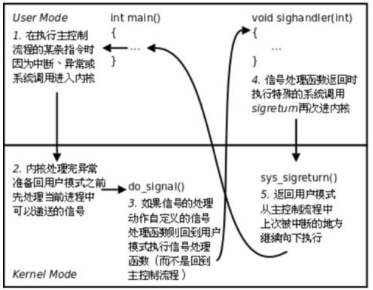

# 异常控制流（ECF）Exceptional Control Flow 

## 概述

* 控制流：程序运行时候的指令序列,控制流在内存中按顺序执行单条指令。 

* physical控制流：cpu实际执行的指令序列

* 改变控制流：
  * 程序状态改变
    * jmp 	
    * call and return
  * 系统状态改变	 
    * 键盘按Ctrl+C	
    * 磁盘读写
    * ...... 


* 异常控制流存在 ：
  * 1)底层：
    * 异常：响应某些底层系统事件的控制流变化，使用操作系统软件和硬件组合实现异常。
  * 2)高层：
    * 进程上下文切换（硬件和操作系统内核共同实现）
  * 3)更高层(由操作系统软件实现)：
    * 信号
  * 4)语言层次(C库的非本地跳转)： 
    * setjmp()
    * longjmp()

## 异常

### 分类

* 异常的分类：

  * 中断是`异步`断是由于处理器外部发生的状态变化引起的，不是由指令产生的。

  | 类别 |       原因        | 异步/同步 |       返回行为       |             举例             |
  | :--: | :---------------: | :-------: | :------------------: | :--------------------------: |
  | 中断 | 来自I/O设备的信号 |   异步    | 总是返回到下一条指令 | 磁盘I/O完成，DMA完成，定时器 |
  | 陷阱 |    有意的异常     |   同步    | 总是返回到下一条指令 |           系统调用           |
  | 故障 | 潜在可恢复的错误  |   同步    |  可能返回到当前指令  |            页缺失            |
  | 终止 |  不可恢复的错误   |   同步    |       不会返回       | 访问未分配的内存，浮点数异常 |

* 系统调用中参数存放寄存器：%rdi,%rsi,%rdx,%r10,%r8,%r9,最多六个参数,%rax是存放系统调用号，同时%rax返回状态，负数表示出错。

## 进程

* 每一个进程是一个逻辑控制流，它有三种状态：running（正在运行或者能够被调度运行的进程），stopped（执行被暂停，不能被调度运行的进程，可以通过信号调度其运行），terminated（永远不运行）。

### 获取进程ID

```c
#include<sys/types.h>
#include<unistd.h>
//pid_t means int;
pid_t getpid(void)
pid_t getppid(void)
```

### 创建和终止进程

* 进程终止原因：
  * 收到信号终止。
  
  * 从main函数返回自动调用exit终止

  * 程序中主动调用exit终止
  
    
  
    //书上只讲了三种 实际上有8种：
  
    进程种植的方式有8种，前5种为正常终止，后3种为异常终止：
    1 从main函数返回
    2 调⽤用exit函数；
    3 调⽤用_exit或_Exit；
    4 最后⼀一个线程从启动例程返回；
    5 最后⼀一个线程调⽤用pthread_exit；
    6 调⽤用abort函数；
    7 接到⼀一个信号并终⽌止；
    8 最后⼀一个线程对取消请求做出响应。
  
* 进程终止过程

* ```c
  #include <stdlib.h>
  void exit( int status );
  void _Exit( int status );
  #include <unistd.h>
  void _exit( int status );
  ```

  _exit和_Exit立即进入内核，而exit要先做一些清理工作（调用执行个终止处理程序，关闭所有标准I/O流），再进入内核。三个函数所带的整形参数称为终止状态或退出状态，如果（a）调用这些函数不带参数，（b）main函数中的return 语句无返回值，（c）main函数没有声明返回类型为整形，则进程的终止状态是未定义的。main函数返回一个整形值与用该值调用exit是等价的。
  **注意：**
  exit函数运行时首先会执行由atexit()函数登记的函数，然后会做一些自身的清理工作，同时刷新所有输出流、关闭所有打开的流并且关闭通过标准I/O函数tmpfile()创建的临时文件。
  exit()函数用于在程序运行的过程中随时结束程序，exit的参数state是返回给操作系统,返回0表示程序正常结束，非0表示程序非正常结束。
  **atexit函数：**
  atexit函数是一个特殊的函数，它是在正常程序退出时调用的函数，我们把他叫为登记函数
  （函数原型：int atexit (void (*)(void))）

  ```
  一个进程可以登记若32个函数，这些函数由exit自动调用，这些函数被称为终止处理函数，atexit函数可以登记这些函数。
  exit调用终止处理函数的顺序和atexit登记的顺序相反，如果一个函数被多次登记，也会被多次调用。
  ```

* 创建进程：

  ```c
  int fork(void)//父进程返回值为子进程的pid，子进程返回0;
  ```

* 僵尸进程

  保留了PID,终止状态，资源使用信息，并且在全局的进程表里有一个表项。

  * 父进程使用wait和waitpid回收子进程，如果子进程比父进程先结束，则子进程exit后变为僵尸进程等待父进程回收，如果父进程比子进程先结束，那么子进程会被1号进程init回收。

    ```c
    #include<sys/types.h>
    #include<wait.h>
    //参数pid:pid>0 则等待进程号为pid的子进程终止，pid=-1则是父进程所有的子进程
    //statusp:指向status(statusp可以为空)，会保存导致返回的子进程的状态信息
    //option：WNOHANG:如果等待集合中任何子进程都没终止立刻返回0。
    //		 WUNTRACED:挂起调用进程，直到等待到一个进程终止，返回的（引起返回的那个子进程的）pid
    //		 WCONTINUED:挂起调用进程直到等待集合中一个正在运行的进程终止或者一个子进程收到SIGCONT信号重新开始执行
    //waitpid挂起调用waitpid的进程直到有子进程终止。如果在这之前已经有子进程终止，直接返回终止子进程的进程号。
    pid_t waitpid(pid_t pid,int *statusp,int options);
    pid_t wait(int *statusp);//没有指定等待哪一个进程终止，调用wait的那个进程一直等待直到创建的某个子进程终止
    //错误返回-1，并根据错误信息设置errno。
    ```

  * 系统不会按照特定的顺序回收子进程，子进程回收是计算机系统的属性，是一个不确定的行为，但是可以通过每次指定回收的进程号来按顺序回收。

* 加载运行程序execve

  * 相当于在一个进程上用新的程序把这个进程覆盖，沿用了一些这个进程原来的一些结构，重写了一些新的结构
  * 保留了进程PID，文件打开相关数据结构和*（signal context)*//不明白这个是啥
  * 重写了代码段，数据段和栈区，创建一个新的空堆。
  * 调用一次，不返回。如果可执行文件不存在，返回-1.

  ```c
  #include<unistd.h>
  int execve(const char *filename,const char *argv[],const char *envp[]);
  //						文件名				命令行参数				环境变量
  //filename：可执行文件名，可以使shell脚本或者别的脚本
  //agrv[]：命令行参数，argv[0]是可执行文件名
  //rnvp："USER=ZRF"这样的字符串
  //一般在子进程中用execve
  ```

  

## 信号（由shell的缺陷引出信号，因为后台进程无法被回收资源）

* 又称linux信号，信号是由内核发出的，或者由某些进程请求内核发出信号给另外一些进程。


### 一些特殊的信号

| ID   | 名称    | 默认行为              | 相应事件                                               |
| ---- | ------- | --------------------- | ------------------------------------------------------ |
| 2    | SIGINT  | 终止                  | 来自键盘的中断（CTRL+C）                               |
| 9    | SIGKILL | 终止                  | 杀死程序（不同于SIGINT是它不能被任何方式忽略或者覆盖） |
| 11   | SIGSEGV | 终止                  | 无效的内存引用（段错误）                               |
| 14   | SIGALRM | 终止                  | 来自alarm函数定时器的信号                              |
| 17   | SIGCHLD | 忽略                  | 一个子进程停止或者终止                                 |
| 19   | SIGSTOP | 停止直到下一个SIGCONT | 不是来自终端的停止信号                                 |

* ctrl-c会使内核向前台进程组下所有的作业发送SIGINT信号（终止进程），ctrl-z会使内核向前台进程组下所有作业发送SIGTSTP信号（挂起进程，收到SIGCONT可以继续运行）
* SIGKILL和SIGSTOP不能被捕获，也不能被忽略。

### 信号术语

* 传送信号步骤：

  * 发送信号（可以发送给一个进程或者一个进程组中的所有进程）：

    * 内核通过更新目标进程的上下文中的某些状态某些位来实现发送信号给一个进程。

    * 一般是内核监控了一些事件的发生而发送信号（除0的发生，段错误等等），或者某些进程请求内核发送一个信号给一个进程（kill某个进程）。

    * **方式**：

      * 用kill发送信号（shell）

      ```shell
      linux>kill -9 24818		//linux下，-9表示发送9号信号SIGKILL 24818表示进程号
      linux>kill -9 -24818	//-24818表示发送信号给该进程所在进程组的所有进程
      ```

      * 用键盘发送信号（ctrl+c或者ctrl+z）

      * 用kill/alarm等函数发送信号（**kill是发送信号，而不是杀死进程！！！**）

      ```c
      #include<sys/types.h>
      #include<signal.h>
      int kill(pid_t pid,int sig);//成功返回0，失败返回-1。
      //pid>0发送信号sig给pid。
      //pid=0发送信号sig给调用进程所在进程组中所有进程，包括自己。
      //pid<0发送信号给进程组（-pid）中所有进程。
      
      ```
  
    unsigned int alarm(unsigned int secs);//发送SIGALRM信号给调用进程
      ```
    
      
      ```
  
* 接收信号：当目的进程被内核强迫以某种方式对信号作出反应，才是接收了信号。
  
  * 忽略信号。
  
  * 终止进程。
  
  * 用用户级的信号处理函数（即信号处理程序signal handler）捕获信号。
  
    [^信号处理程序]: 信号处理函数与异常处理函数不同，异常处理函数是在系统内核内的，而信号处理函数是在用户级的C程序代码里的。
  
  * 待处理信号：如果一个信号已经由内核发出，但是还没有被接收，则被称作待处理信号。**在某个时刻，一种类型的待处理信号一次只能存在一个，后续相同的信号会被简单地丢弃。**
  
  * 进程不能阻止信号的传递，但是他可以屏蔽某些信号，从而阻止进程在接收到信号后对信号作出响应。
  
    * 内核保留了两个32位int类型的向量blocked和pending。每一位代表一个信号。
  
      ```c
      pnb=pending & ~blocked;
      if(pnb==0)
      	//正常执行下一条指令
    else
      	//选择pnb中最小的非零位，强制接收。
      ```
    ```
    
    * 通过signal函数修改和信号相关的默认行为。
    
      * 一般的默认行为:
        1. 进程终止
      2. 进程终止并转储内存
        3. 进程停止（挂起）直到被SIGCONT信号重启
        4. 进程忽略该信号
    
      ```c
      #include<signal.h>
      typedef void (*sighandler_t)(int);
      sighandler_t signal(int signum,sighandler_t handler);
      //若成功则返回指向前次处理函数的指针，若出错则返回SIG_ERR，但是不设置errno。
      //handler:
      	//1.SIG_IGN:忽略该信号
    	//2.SIG_DFL:恢复该信号默认行为
      	//3.用户定义的函数地址，该函数称为信号处理程序。收到sigal，调用处理程序过程被称作“捕获信号”
    ```
  
  * *(这部分太底层，还不太明白，不清楚说的对不对)系统的信号处理返回时候会调用signalreturn()函数？然后再返回用户态。用户定义的信号处理程序全在用户态。*
  
    
  
    
  
* 阻塞信号和解除阻塞信号
  
     * 阻塞信号：
    
          * 隐式阻塞：当前正在处理的信号类型，如果后续还有相同的信号来则自动被阻塞。
      
            * 显式阻塞：通过sigprocmask函数阻塞和解除信号。
      
                 ```c
                 #include<signal.h>
                 int sigprocmask(int how,const sigset_t *set,sigset_t *oldset);
                 //how:SIG_BLOCK添加set	SIG_UNBLOCK删除set	SIG_SETMASK 设置为set
                 int sigemptyset(sigset_t *set);
                 int sigfillset(sigset_t *set);
                 int sigaddset(sigset_t *set,int signum);
                 int sigdelset(sigset_t *set,int signum);
                 //以上成功返回0，出错返回-1。
               int sigismember(const sigset_t *set,int signum);
                 //若signum是set成员返回1，不是返回0，出错返回-1。
                 
            ```
  
  int sigsuspend(const sigset_t *mask);//暂时用mask替换当前阻塞集合，然后挂起该进程，直到收到一个信号，该信号的行为要么是运行一个信号处理程序，要么是终止该进程。如果是终止该进程，那么程序不从sigsuspend返回就直接终止，如果行为是运行一个处理程序，那么sigsuspend从处理程序返回，恢复调用sigsuspend时候原有的阻塞集合。
                 
                 //总的来说sigsuspend可以看做原子的如下三行代码：
                 sigprocmask(SIG_SETMASK,&mask,&prev);//或者写sigprocmask(SIG_BLOCK,&mask,&prev);
                 pause();//挂起自己，等待信号唤醒自己
                 sigprocmask(SIG_SETMASK,*prev,NUKK);
                 ```
  
  
  ​               

### 编写信号处理程序原则

1. 程序尽可能简单（比如仅仅设置一个全局标志就返回）
2. 在处理程序中调用异步信号安全的函数（所谓异步信号安全指的是要么函数是可重入的，要么不能被信号处理程序中断的）
3. 因为errno是全局的，而信号处理程序中某些函数可能会改变errno，所以要在进入信号处理程序之前保存errno，并在返回时恢复。（不返回直接退出的就没必要设置）
4. 用volatile声明全局变量，可以防止编译器把变量放入寄存器。
5. 用sig_atomic_t（32位，int）声明标志，对这样的变量读写是原子的，不可中断的。// volatile sig_atomic_t flag

## 非本地跳转

非本地跳转将控制直接从一个函数转移到另一个当前正在执行的函数，而不需经过正常的调用-返回序列。需要setjmp和longjmp配合完成。

* 作用：在一个深层嵌套的函数调用中立即返回，通常是检测到某个错误情况引起的，可以直接跳转到本地化的错误处理程序，而非一层层解开调用。
* 对于C++的try&catch/throw，可以把catch看做setjmp,throw看做longjmp

### setjmp

```c
#include<setjmp.h>
int setjmp(jmp_buf env);//setjmp第一次返回0，但该返回值不能赋值给变量，可以在判断，switch等条件语句中测试。在env缓冲区中保存当前的调用环境。
int sigsetjmp(sigjmp_buf env,int savesigs);//信号处理程序使用的版本
```

setjmp只调用一次返回多次，一次是当第一次调用setjmp时，把环境保存在env内的返回；一次是对应每个longjmp调用，都有一个相应的返回。

### longjmp

```c
#include<setjmp.h>
void longjmp(jmp_buf env,int retval);//longjmp从env缓冲区中恢复调用环境，然后触发一个从最近一次初始化env的setjmp调用的返回，retval为非零返回值！！！这个返回值是给setjmp返回时候用的！！非零返回值指明了错误类型！！（longjmp函数本身是void）
void siglongjmp(sigjmp_buf env,int retval);//信号处理程序使用的版本
```

longjmp只调用一次，没有返回。

## 注意

信号处理程序中产生输出唯一安全的方法是write函数，printf和sprintf是不安全的。

因为信号没有排队机制，所以不能用信号来计数。当信号处理程序正在处理一个信号时候，又有一个待处理信号，后续到达的信号会被丢弃（仅仅是覆盖了之前写过的bit位置1，看起来好像被丢弃了一样）。

longjmp可能会产生内存泄漏，因为跳过了很多处理机制，比如某些中间函数调用中分配了某些内存，而longjmp跳过了释放内存的部分。