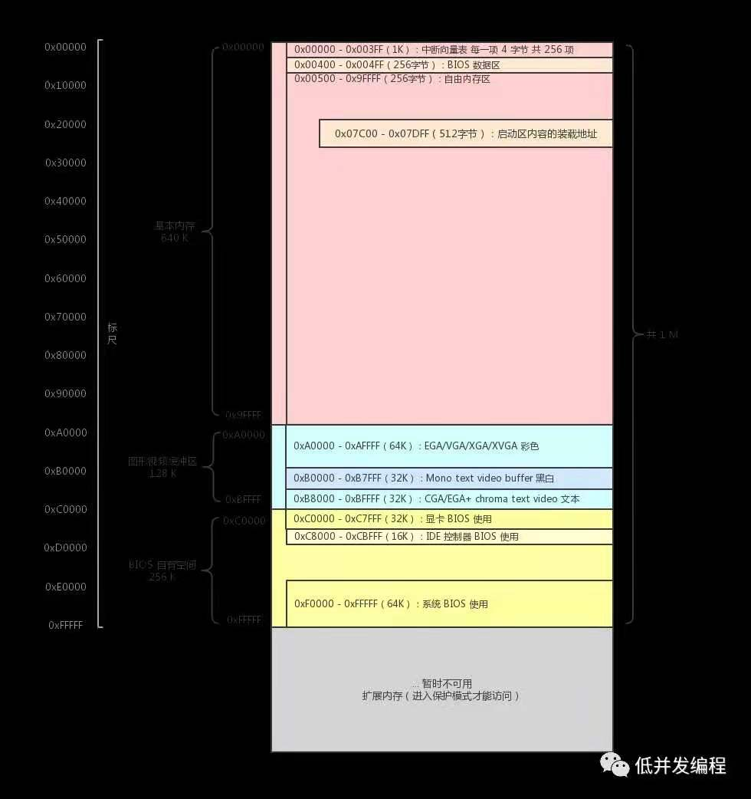

# 开机启动（古老的8086处理器）

multiboot格式参考[【转载】Multiboot规范 - Wasdns - 博客园 (cnblogs.com)](https://www.cnblogs.com/qq952693358/p/6713215.html)

* 从按下电源键开始，CPU会重置，把第一条指令的地址初始化为` 0xffff0`（现在32位是`0xfffffff0`）（具体实际上是把cs段寄存器初始化为` 0xf000` ,偏移地址寄存器设置为` 0xfff0`,所以真实物理地址就是段寄存器左移四位+偏移就是` 0xffff0`）

*  。 而内存中的地址一部分会映射到外设上，比如一部分映射到显存，一部分映射给硬盘控制器等等。而BIOS的空间会被映射到` 0xc0000`-` 0xfffff`的位置，同时BIOS的程序还占用了内存中开头的一些位置，把中断向量表写在内存开始的一些地方。其中系统BIOS占用了` 0xf0000`-` 0xfffff` 的空间。

* 又因为第一条指令的地址为` 0xffff0`，所以从` 0xffff0`-` 0xfffff`只有16字节的空间代码，但是这个代码肯定不够写，所以这里是一条跳转地址

  ```
  jmp far f000:e05b//意思是跳转到物理地址0xfe05b去运行
  ```

* 地址` 0xfe05b` 部分的代码会检测一些外设的信息，并初始化好硬件，建立中断向量表并填写中断例程，实际上这部分就是写死的。然后最后就是加载启动区。那么何为BIOS启动区。

* BIOS里面就有一张启动设备表，BIOS会按照这 个表里面列出的顺序查找可启动设备。那么怎么知道该设备是否可以启动呢？规则其实很 简单：如果这个存储设备的第一个扇区中512个字节20的最后两个字节是0x55和0xAA，那么 该存储设备就是可启动的。这是一个约定，所以BIOS会对这个列表中的设备逐一检测，只 要有一个设备满足要求，后续的设备将不再测试。 当BIOS找到可启动的设备后，便将该设备的第一个扇区加载到内存的0x7C00地址处， 并且跳转过去执行。（通过in/out指令来把设备中的内容复制到内存）（这个0x7c00是BIOS开发团队设定的），而这段512字节的代码就是所谓的bootloader程序。（早期BIOS团队假设操作系统需要最小内存为32KB，但是又想仅仅留512字节不太好，再多保留一些栈数据，就保留了1KB字节（0x400），所以0x7c00+0x400=0x8000刚好是32KB.

  ```asm
  ; hello-os
  ; TAB=4
  
    ORG  0x7c00   ;程序加载到内存的 0x7c00 这个位置
  
  ;程序主体
  
  entry:
    MOV  AX,0   ;初始化寄存器
    MOV  SS,AX
    MOV  SP,0x7c00
    MOV  DS,AX   ;段寄存器初始化为 0
    MOV  ES,AX
    MOV  SI,msg
  putloop:
    MOV  AL,[SI]
    ADD  SI,1
    CMP  AL,0   ;如果遇到 0 结尾的，就跳出循环不再打印新字符
    JE  fin
    MOV  AH,0x0e   ;指定文字
    MOV  BX,15   ;指定颜色
    INT  0x10   ;调用 BIOS 显示字符函数
    JMP  putloop
  fin:
    HLT
    JMP  fin
  msg:
    DB  0x0a,0x0a  ;换行、换行
    DB  "hello-os"
    DB  0x0a   ;换行
    DB  0    ;0 结尾
  
    RESB 0x7dfe-$   ;填充0到512字节
    DB 0x55, 0xaa   ;可启动设备标识
  ```

* 然后启动区中的代码任务主要是加载操作系统，并跳转到操作系统加载处。（上面的bios并没有说明函数的入口，另一版本的boot.s在源代码中）



# 字符显示

* 我们知道，对于一个字符的编码通常有输入码、内码和字模码三种。其中字模码定义了 一个字符在屏幕上显示的点阵坐标。通常显卡内置一套关于基本英文字符的显示是很容易 做到的，而内置汉字的显示就较为麻烦。在这篇文档中我们只使用显卡的文本模式，不会 涉及到图形模式的内容。因为一旦使用了图形模式的内容，我们就需要自行定义字符的字 模码了，这很繁琐而且对我们理解操作系统原理的意义不是很大。所以我们只使用显卡的 文本模式进行屏幕显示控制。所有在PC上工作的显卡，在加电初始化之后都会自动初始化 到80*25的文本模式。在这个模式下，屏幕被划分为25行，每行可以显示80个字符，所以 一屏可以显示2000个字符。上图中的0xB8000～0xBFFFF这个地址段便是映射到文本模式的 显存的。当访问这些地址的时候，实际上读写的是显存区域，而显卡会周期性的读取这里 的数据，并且把它们按顺序显示在屏幕上。 那么，按照什么规则显示呢？这就要谈到内码了。内码定义了字符在内存中存储的形 式，而英文编码就是大家所熟知的ASCII（American Standard Code for Information Interchange，美国信息交换标准代码）码了。对应的关系很简单，从0xB8000这个地址开 始，每2个字节表示屏幕上显示的一个字符。从屏幕的第一行开始对应，一行接着一行的对 应下去。而这两个字节的前一个是显示字符的ASCII码，后一个是控制这个字符颜色和属性 的控制信息，这个字节的8个bit位表示不同的含义。每一位的含义如图所示


* 理解了显卡文本模式的原理之后接下来就是对屏幕显示控制编码了。不过显卡除了显 示内容的存储单元之外，还有部分的显示控制单元需要了解。这些显示控制单元被编制在 了独立的I/O空间里，需要用特殊的in/out指令去读写。这里相关的控制寄存器多达300多 个，显然无法一一映射到I/O端口的地址空间。对此工程师们解决方案是，将一个端口作为 内部寄存器的索引：0x3D4，再通过0x3D5端口来设置相应寄存器的值。


# Debug  printk 和可变参数

* 因为系统底层没有stdin和stdout这种，所以可以通过之前写的screen_write()函数往屏幕上打印字符，但是这里要用到可变参数，即类似printf的可变参数形式。

* ` void printk(const char *format, ...);` 可变参数是通过gcc编译器中内置的va_list来实现的，一些地方也把它定义成宏。

  ```c++
  #define va_list char *
  #define va_start(p, first) (p = (va_list)&first + sizeof(first))//将指针p变成可变参数的第一个参数地址
  #define va_arg(p, next) (*(next*)((p += sizeof(next) ) − sizeof(next)))//将指针p指向下一个参数地址，并返回当前参数的值
  #define va_end(p) (p = (va_list)NULL)//将p定义为NULL
  //调用
  va_start(args,format);
  ```

  

## x86-64函数调用栈和寄存器传递参数

* 以下是64位环境下的，32位环境下所有参数都是通过栈来传递的。

* 在内存中，栈是向下增长的。假设我们写了这么一段程序，

  ```c++
  struct st
  {
          int a;
          int b;
          double c;
  };
  void f(st x,int x1,int x2,int x3,int x4,int x5,int x6,int x7,int x8)
  {
  
  }
  int main()
  {
          int i=1;
          int j=2;
          int k=3;
          st x;
          x.a=1;
          x.b=2;
          x.c=3.0;
          f(x,i,j,k,4,5,6,7,8);
          return 0;
  }
  ```

*  main函数栈帧如下

*  **这里有一个细节，如果被调用的函数是最后一次调用的函数，他的最后一个函数栈帧rsp和rbp是同一个位置，但是还是可以使用rbp以下的空间。**

* 其中栈中数字6，7，8虽然在main函数的栈帧中，但是属于f函数栈帧中可以访问的内容，因为他是参数传递过去的临时变量。

  

* 部分汇编代码如下

  

## 可变参数传递

由于是可变参数，所以所有参数都是在栈上的，通过va_list即可调取参数列表。这些都是gcc编译器内置的变量和函数，或者也可以把他们定义成如下的宏，va_list为参数的起始地址。

```c++
#define va_list char *

#define va_start(p, first) (p = (va_list)&first + sizeof(first))
#define va_arg(p, next) (*(next*)((p += sizeof(next) ) − sizeof(next)))
#define va_end(p) (p = (va_list)NULL)
```

## printk

* 类似于printf，printk通过调用vsprintf来输出格式化的字符串。
* vsprintf通过三个方面来输出，一个是输出串的位宽，一个是小数的精度（内核中没有浮点数的计算，所以这里用不到），一个是输出的是什么类型的字符，整形、字符串、8进制、16进制等等。
* 具体见代码printk.c

# 代码级调试

## 打印函数调用栈

```asm
; ----------------------------------------------------------------
;
; 	boot.s -- 内核从这里开始
;
;                 这里还有根据 GRUB Multiboot 规范的一些定义
;
; ----------------------------------------------------------------

MBOOT_HEADER_MAGIC 	equ 	0x1BADB002 	; Multiboot 魔数，由规范决定的

MBOOT_PAGE_ALIGN 	equ 	1 << 0    	; 0 号位表示所有的引导模块将按页(4KB)边界对齐
MBOOT_MEM_INFO 		equ 	1 << 1    	; 1 号位通过 Multiboot 信息结构的 mem_* 域包括可用内存的信息
						; (告诉GRUB把内存空间的信息包含在Multiboot信息结构中)

; 定义我们使用的 Multiboot 的标记
MBOOT_HEADER_FLAGS 	equ 	MBOOT_PAGE_ALIGN | MBOOT_MEM_INFO

; 域checksum是一个32位的无符号值，当与其他的magic域(也就是magic和flags)相加时，
; 要求其结果必须是32位的无符号值 0 (即magic + flags + checksum = 0)
MBOOT_CHECKSUM 		equ 	- (MBOOT_HEADER_MAGIC + MBOOT_HEADER_FLAGS)

; 符合Multiboot规范的 OS 映象需要这样一个 magic Multiboot 头

; Multiboot 头的分布必须如下表所示：
; ----------------------------------------------------------
; 偏移量  类型  域名        备注
;
;   0     u32   magic       必需
;   4     u32   flags       必需 
;   8     u32   checksum    必需 
;
; 我们只使用到这些就够了，更多的详细说明请参阅 GNU 相关文档
;-----------------------------------------------------------

;-----------------------------------------------------------------------------

[BITS 32]  	; 所有代码以 32-bit 的方式编译

section .text 	; 代码段从这里开始

; 在代码段的起始位置设置符合 Multiboot 规范的标记

dd MBOOT_HEADER_MAGIC 	; GRUB 会通过这个魔数判断该映像是否支持
dd MBOOT_HEADER_FLAGS   ; GRUB 的一些加载时选项，其详细注释在定义处
dd MBOOT_CHECKSUM       ; 检测数值，其含义在定义处

[GLOBAL start] 		; 内核代码入口，此处提供该声明给 ld 链接器
[GLOBAL glb_mboot_ptr] 	; 全局的 struct multiboot * 变量
[EXTERN kern_entry] 	; 声明内核 C 代码的入口函数

start:
	cli  			 ; 此时还没有设置好保护模式的中断处理，要关闭中断
				 ; 所以必须关闭中断
	mov esp, STACK_TOP  	 ; 设置内核栈地址
	mov ebp, 0 		 ; 帧指针修改为 0
	and esp, 0FFFFFFF0H	 ; 栈地址按照16字节对齐
	mov [glb_mboot_ptr], ebx ; 将 ebx 中存储的指针存入全局变量
	call kern_entry		 ; 调用内核入口函数
stop:
	hlt 			 ; 停机命令，什么也不做，可以降低 CPU 功耗
	jmp stop 		 ; 到这里结束，关机什么的后面再说

;-----------------------------------------------------------------------------

section .bss 			 ; 未初始化的数据段从这里开始
stack:
	resb 32768 	 	 ; 这里作为内核栈
glb_mboot_ptr: 			 ; 全局的 multiboot 结构体指针
	resb 4

STACK_TOP equ $-stack-1 	 ; 内核栈顶，$ 符指代是当前地址

;-----------------------------------------------------------------------------
```

1. 初始定义

   ```asm
   MBOOT_HEADER_MAGIC 	equ 	0x1BADB002 	;
   MBOOT_PAGE_ALIGN 	equ 	1 << 0    	; 
   MBOOT_MEM_INFO 		equ 	1 << 1    	;  
   MBOOT_HEADER_FLAGS 	equ 	MBOOT_PAGE_ALIGN | MBOOT_MEM_INFO
   MBOOT_CHECKSUM 		equ 	- (MBOOT_HEADER_MAGIC + MBOOT_HEADER_FLAGS)
   ```

   - MBOOT_HEADER_MAGIC：multiboot规范规定；
   - MBOOT_PAGE_ALIGN：`equ`为等于，`1<<0`相当于0001；
   - MBOOT_MEM_INFO：`1<<1`相当于0010；
   - MBOOT_HEADER_FLAGS：`|`为or处理，得：0011；
   - MBOOT_CHECKSUM：规范要求三者和为0。

2. start

   START 表示进程段的开始，END START就是结束。
   不过START不是关键词，它是一个标识可以用户自己随意使用，不过不能用保留字，关键词，一般还有用main的。用法一样，首先main，结束end main。一般编程一定要有

3. `call kern_entry`

   调用kern_entry，进入C函数内核；

4. 栈

   ```
   stack:
   	resb 32768 	 	 ; resb预留空间，单位为字节，这里是2^15，32KB的空间
   glb_mboot_ptr: 			 ; 全局的 multiboot 结构体指针
   	resb 4
   STACK_TOP equ $-stack-1 ;$表示当前栈针地址
   ```

   RESB命令是“reserve byte”的略写预约字节。

   栈是上低下高，由高向低生长，所以`ebp`是栈基，在最高位，减去stack，也就是预留了内核的栈空间，所以`STACK_TOP`在最低位，在上面。

5. `eax`

    必须包含魔数 0x2BADB002；这个值指出操作系统是被一个符合 Multiboot 规范的引导进程载入的。

6. `ebx`

   必须包含由引导进程提供的 Multiboot 信息结构的物理地址。 按照协议，GRUB把一些计算机硬件和我们内核文档相关的信息放在了一个结构体中，并且将这个结构体指针放在了ebx寄存器中。

## hx_kernel反汇编以及打印函数调用栈

* 关键代码：

```asm
0010000c <start>:
  10000c:	fa                   	cli    ;关中断
  10000d:	bc 03 80 00 00       	mov    esp,0x8003;初始化内核栈顶指针
  100012:	bd 00 00 00 00       	mov    ebp,0x0;初始化内核栈底指针
  100017:	83 e4 f0             	and    esp,0xfffffff0;保证栈顶指针16字节对齐
  10001a:	89 1d 00 b0 10 00    	mov    DWORD PTR ds:0x10b000,ebx;把ebx寄存器中存储的multiboot_t结构体指针传递给全局变量glb_mboot_ptr
  100020:	e8 e7 07 00 00       	call   10080c <kern_entry>;实际做了push 返回地址，然后jmp 10080c跳转到kern_entry函数入口

00100025 <stop>:
  100025:	f4                   	hlt    
  100026:	eb fd                	jmp    100025 <stop>
```

* 打印函数调用栈是通过出错时候，获取当前函数的ebp寄存器中的值，即可知道当前栈帧的栈底，通过栈底指针指向的地址可以知道上一函数的栈底ebp，栈底指针+1可知本函数返回地址的下一条指令地址，然后可以通过指令地址，到elf结构体中去查找当前指令所在函数名。

# 实模式与保护模式

## 什么是实模式和保护模式


Intel 8086 是一个由 Intel 于 1978 年所设计的 16 位微处理器芯片，**是 x86 架构的鼻祖**。紧接着 Intel 又推出了第一款 32 位的 cpu Intel 80286（很快被淘汰，80386更经典一些），这款 cpu 由于和之前有很多不同的"保护"特性，所以称为**保护模式**，也是与此同时，之前的 8086 这个 16 位 cpu 才有了**实模式**的叫法。

所以什么是实模式和保护模式，其实**就是 Intel 给自己的处理器特性命的一个名字**而已，具体有哪些特性那就是细节问题了，但最起码有一点刚刚已经有所透露，那就是保护模式至少是 32 位的，而实模式是 16 位的（即使一个 32 位的 cpu 也有实模式）


## 实模式与保护模式的区别是什么


1. **位数**：实模式 16 位，保护模式 32 位
2. **地址计算**：实模式下的地址是段寄存器地址左移 4 位 + 偏移地址得到物理地址。保护模式下段寄存器存入了段选择子，在段描述符表中寻找段基址，再加上偏移地址得到物理地址（如果开启分页下这里为虚拟地址，还需要再次经过 MMU 转换为最终的物理地址）
3. **寻址空间**：这个我觉得是 1 的推论，就是实模式寻址空间是 1M，保护模式是 4G
4. **安全性**：保护模式下分了四个特权级（0、1、2、3），有两个是我们熟悉的用户态（3）和内核态（0）。比如全局描述符表的段描述符中就有记录特权级的位，配合硬件机制可以在某些情况对程序做到保护，这种"保护"我们得之后慢慢体会。


## 怎么进入保护模式


进入保护模式在 CPU 层面特别简单，它只是一个开关，即把 cro 寄存器（机器状态字）的位 0 置为 1 即可。


一段几乎固定的代码即可完成（ lmsw 汇编指令即是加载机器状态字的指令）

```
mov ax, 0x0001
lmsw ax
```

这很简单，但重点确是进入保护模式之前的那些准备工作。这一步就好比你和你女朋友/男朋友结婚一样，实际操作上来说，就是去民政局领个证，但领证之前的相识、表白、相爱、分手、复合，这些才是关键。

所以，我们接下来看一看，进入保护模式之前，都需要做哪些准备工作。

- 打开 A20 地址线

- 开启分段机制

- - 内存某位置写好段描述符表
  - 加载段描述符表地址到 gdtr 寄存器
  - 将 cr0 寄存器的 pe 位置 1

- 从实模式切换到保护模式

- 开启分页机制

- - 在内存某位置写好页目录表和页表
  - 加载页目录表地址到 cr3 寄存器
  - 将 cr0 寄存器的 pg 位置 1

- 开启中断机制

- - 在内存某位置写好中断描述符表
  - 初始化可编程中断控制器 PIC
  - 加载中断描述符表（idt）地址到 idtr 寄存器

简单理解，这一步就是为了突破地址信号线 20 位的宽度，变成 32 位可用。这是由于 8086 CPU 只有 20 位的地址线，所以如果程序给出 21 位的内存地址数据，那多出的一位就被忽略了，比如如果经过计算得出一个内存地址为 1 0000 00000000 00000000 ，那实际上内存地址相当于 0

当 CPU 到了 32 位时代之后，由于要考虑**兼容性**，还必须保持一个只能用 20 位地址线的模式，所以如果你不手动开启的话，即使地址线已经有 32 位了，仍然会限制只能使用其中的 20 位。

开启 A20 地址线也很简单，同样也是一段几乎固定的代码即可完成

```
in al,0x92
or al,0000_0010b
out 0x92,al
cli
```

# 80386下的保护模式

* 我们知道，对CPU来讲，系统中的所有储存器中的储存单元都处于一个统一的逻辑储存 器中，它的容量受CPU寻址能力的限制。这个逻辑储存器就是我们所说的线性地址空间。 8086有20位地址线，拥有1MB的线性地址空间。而80386有32位地址线，拥有4GB的线性地 址空间。但是80386依旧保留了8086采用的地址分段的方式，只是增加了一个折中的方案， 即只分一个段，段基址0×00000000，段长0xFFFFFFFF（4GB），这样的话整个线性空间可 以看作就一个段，这就是所谓的平坦模型（Flat Mode）。
* 考虑到各种属性和需要设置的操作，32位保护模 式下对一个内存段的描述需要8个字节，其称之为段描述符（Segment Descriptor）。段 描述符分为数据段描述符、指令段描述符和系统段描述符三种。
* 参考（https://blog.csdn.net/me1171115772/article/details/51750442）
* 


* 因为有很多段，所以这些段被放在内存中，通过段描述符表来管理。在很多的段描述符表中，最重要的就是全局段描述符表，也就是所谓的` GDT`表（Global Descriptor Table，GDT），它为整个软硬件系统服务。这个段描述符表的的地址被放在一个专门的寄存器中，即` GDTR`寄存器，这个寄存器是一个48位的寄存器。这个寄存器0-15位表示GDT的边界位置（数值为表的长度-1，因为从0计算），16-47 位这32位存放的就是GDT的基地址（恰似数组的首地址）。


* 其实80386CPU从加电开始，就自动进入了实模式，此时并不是保护模式。那怎么进入保护模式呢？说来也简单， 80386CPU内部有5个32位的控制寄存器（Control Register，CR），分别是CR0到CR3， 以及CR8。用来表示CPU的一些状态，其中的CR0寄存器的PE位（Protection Enable，保 护模式允许位），0号位，就表示了CPU的运行状态，0为实模式，1为保护模式。通过修改 这个位就可以立即改变CPU的工作模式。

* 不过需要注意的是，一旦CR0寄存器的PE位被修改，CPU就立即按照保护模式去寻址 了，所以这就要求我们必须在进入保护模式之前就在内存里放置好GDT，然后设置好GDTR寄 存器。我们知道实模式下只有1MB的寻址空间，所以GDT就等于被限制在了这里。即便是再 不乐意我们也没有办法，只得委屈就全的先安排在这里。不过进入保护模式之后我们就可 以在4G的空间里设置并修改原来的GDTR了。 OK，现在有了描述符的数组了，也有了“数组指针”（GDTR）了，怎么表示我们要访 问哪个段呢？还记得8086时代的段寄存器吧？不过此时它们改名字了，叫段选择器（段选 择子）。此时的CS等寄存器不再保存段基址了，而是保存其指向段的索引信息，CPU会根据 这些信息在内存中获取到段信息。 地址合成的过程如下图所示：

* 80386之后的保护模式，必原来的CS,ES,SS,DS多了两个寄存器FS,GS
* CS (Code Segment) 代码段
  DS (Data Segment) 数据段
  ES (Extra Segment) 附加段
  SS (Stack Segment) 栈段
* fs,gs是80386起增加的两个bai辅助段寄存器,在这之前只有一个辅助段寄存器ES,增加这两个寄存器是为了减轻ES寄存器的负担,并能更好地配合适用于通用寄存器组的基址和变址寄存器.
* FS：Flag segment标志段寄存器
  GS：Global segment全局段寄存器


## 系统访问地址过程

三、实例（对理解非常有用）

1：访问GDT


段描述符在GDT中

当TI=0时表示段描述符在GDT中，如上图所示：

①先从GDTR寄存器中获得GDT基址。

②然后再GDT中以段选择器高13位位置索引值得到段描述符。

③段描述符符包含段的基址、限长、优先级等各种属性，这就得到了段的起始地址（基址），再以基址加上偏移地址yyyyyyyy才得到最后的线性地址。

2：访问LDT


段描述符在LDT中

当TI=1时表示段描述符在LDT中，如上图所示：

①还是先从GDTR寄存器中获得GDT基址。

②从LDTR寄存器中获取LDT所在段的位置索引(LDTR高13位)。

③以这个位置索引在GDT中得到LDT段描述符从而得到LDT段基址。

④用段选择器高13位位置索引值从LDT段中得到段描述符。

⑤段描述符符包含段的基址、限长、优先级等各种属性，这就得到了段的起始地址（基址），再以基址加上偏移地址yyyyyyyy才得到最后的线性地址。


## 别人的博文copy

这个是本文最难理解的地方了！还记得上面说的地址线有 20 位这个事么？不知道你有没有想过，16 位的实模式怎么可能产生 20 位的地址线呢？这又是一个历史遗留问题。

当时的 CPU 只有 16 位的，但已经可以生产出 1 MB 大小的内存了，CPU 的位数没有跟上内存大小的发展，那 16 位的 CPU 如何产生 20 位的地址信号给内存呢？大佬们想出了如下办法。

在实模式下，程序员给出的线性地址并不是最终的物理地址，**物理地址是由段基址左移 4 位 + 段内偏移地址（程序员给出的线性地址）计算得出的**，所以才勉强可以表示 20 位。


之后当然又是由于兼容性问题，这个别扭的设计一直保留了下来，包括你现在正在用的 CPU （x86 架构的并且在实模式下的）也是如此。

然而保护模式下不一样了

在保护模式下，段基址寄存器中存的数据，被理解为**段选择子**，根据这个值去我们自己在内存中写好的**全局描述符表**中，找到对应的**段描述符**，从中取出**段基址**。用这个段基址加上偏移地址，得到最终的物理地址（如果开启了分页则还需要分页机制的转换，不过逻辑地址和页表的事以后再说，不冲突，因为我们还没有开启分页，目前就是这么转换的）。


物理地址的计算过程，就这么点区别，原来是段寄存器左移四位，现在是段寄存器里的值是用于在全局描述符表中找到相应的段描述符，进而找到段基址。

但段描述符中可不只有段基址，还有很多其他信息，正是这些信息使得 CPU 和我们程序配合可以玩出很多花样，那接下来我们就看看段描述符的具体结构。

**段描述符**是存储在**全局描述符表**中的

**全局描述符表**是一张表，在内存中也就是个**数组**，里面是一个个的**段描述符**紧挨着。


段描述符里面各个位的含义，要是展开讲能说上两三篇博客，这里就不完全展开了，只简单关注重点几项。

- **段基址**：用于计算物理地址用的，上面说过了
- **段界限**：可以设定范围，防止程序访问超出这个范围的地址
- **TYPE**：描述符有很多类型，包括后面要说的中断门、陷阱门、LDT，但这里我们只用到了代码段类型和数据段类型。

按照这个结构，我们通过汇编语言直接在内存的某位置把它写出来（这里的值只是其中一种比较合理的设计方案，不用究其细节）

```
;这里用一个标识表示全局描述符表的内存起始位置
gdt:
;0描述符（没用）
dd	0x00000000
dd	0x00000000
;1描述符(4GB代码段描述符)
dd	0x0000ffff
dd	0x00cf9800
;2描述符(4GB数据段描述符)
dd	0x0000ffff
dd	0x00cf9200
;3描述符(28Kb的视频段描述符)
dd	0x80000007
dd	0x00c0920b
```

这里我们拿**视频段描述符**来分析，提取（拼凑）出段基址的数据，转换为十六进制是 0xb8000。怎么样熟不熟悉，这恰好是**显卡黑白模式**在内存中的映射的起始地址。忘了的同学还是要回顾一下[《计算机启动流程》](http://mp.weixin.qq.com/s?__biz=Mzk0MjE3NDE0Ng==&mid=2247483867&idx=1&sn=76ece31324d32922a7cb9db129decd3f&chksm=c2c67b76f5b1f260bb459e12c029f8e6a7a813055811ab8ed794a3f36d0d7d50e66df27f4f0a&scene=21#wechat_redirect)

这样我们之后再访问内存的时候，就可以指定**段选择子**是 0x3 << 3 这个值了（全局描述符表中第三个描述符代表的段描述符），然后**偏移地址**就可以从 0 开始写了啦，这样就很方便，也不用担心越界，如下

```
;定义一个常量表示视频段选择子
SELECTOR_VIDEO	equ	0x0003<<3
;把视频段选择子加载到段寄存器gs
mov eax, SELECTOR_VIDEO
mov gs, ax
;直接往显卡内存上写数据
mov byte [gs:0x00],'h'
mov byte [gs:0x02],'e'
mov byte [gs:0x04],'l'
mov byte [gs:0x06],'l'
mov byte [gs:0x08],'o'
```

### 这样我用最简单的方式介绍了保护模式下分段机制的工作机理，后面还有很多细节，只能在后面学习的过程中慢慢体会了，不要着急。

下面我们看进入保护模式后进入内核前的下一个准备工作。


# 中断ISR（中断服务程序）

* 
* 中断执行过程： 
  * 1.CPU在执行完当前程序的每一条指令后，都会去确认在执行刚才的指令过程中是否发 送中断请求过来，如果有那么CPU就会在相应的时钟脉冲到来时从总线上读取中断请 求对应的中断向量。然后根据得到的中断向量为索引到IDT中找到该向量对应的中断 描述符，中断描述符里保存着中断处理函数的段选择子；
  * 2.CPU使用IDT查到的中断处理函数段选择子从GDT中取得相应的段描述符，段描述符里 保存了中断处理函数的段基址和属性信息。此时CPU要进行一个很关键的特权检验的 过程，这个涉及到CPL、RPL和DPL的数值检验以及判断是否发生用户态到内核态的切 换。如果发生了切换，还要涉及到TSS段和用户栈和内核栈的切换；
  * 3.确认无误后CPU开始保存当前被打断的程序的现场(即一些寄存器的值)，以便于将来 恢复被打断的程序继续执行。这需要利用内核栈来保存相关现场信息，即依次压入 当前被打断程序使用的eflags、cs、eip、以及错误代码号（如果当前中断有错误代 码）； 
  * 4.最后CPU会从中断描述符中取出中断处理函数的起始地址并跳转过去执行。
* 中断时由硬件产生一个电信号，然后传入给CPU的引脚，或者由软件执行某些指令，发送给CPU一个电信号，从而告诉CPU由中断产生。然后CPU执行完当前指令之后查看是否有中断请求，根据此请求得知中断向量号，然后通过IDTR寄存器获取到IDT表的基地址，再根据中断向量号得知在表中的位置，从而获取到该中断的中断描述符，通过中断描述符中的段选择子，从GDT表中获得段描述符，再根据段描述符路获得段基址，段基址加上中断描述符中的便宜地址即中断程序的入口地址。

##  中断的分类

**> 外部中断**

外部中断通过两个引脚连接到 CPU 上，一个是**可屏蔽中断 INTR**，一个是**不可屏蔽中断 NMI**

- **INTR**：硬盘、打印机、网卡等设备发出的中断信号，可通过 eflags 寄存器的 IF 位将所有这些外部设备的中断屏蔽
- **NMI**：电源掉电、内存读写错误、总线奇偶校验错误等灾难性的错误，不可屏蔽，CPU 必须立刻处理

对于可屏蔽中断，Linux 的处理方式是分成 **上半部** 和 **下半部**。上半部执行时关闭中断，立刻执行完毕；下半部执行时打开中断，此时如果有其他中断进来，则让给其他中断。

**> 内部中断**

内部中断可分为**软中断**和**异常**，二者均是不可屏蔽的（即不受 eflags 的 IF 位影响）

- **软中断**：就是软件发起的中断，最常见的也是我们之后进行系统调用的，就是 **int 8 位立即数**，可表示 256 中中断。还有一些不常用的，甚至可以叫做异常，下面简单列出

- - int3：中断向量号3，调试断点指令
  - into：中断向量号4，中断溢出指令
  - bound：中断向量号5，检查数组索引越界指令
  - ud2：中断向量号6，未定义指令，常用于软件测试中主动发起这个中断

- **异常**：指令执行期间 CPU 内部产生的错误引起，如分母为 0 将发起 6 号中断（异常），未定义的指令发起 6 号中断

- - Fault（故障）：可恢复的错误。发生此中断时，CPU 将机器状态恢复到异常之前的状态，之后调用中断处理程序，结束后返回。常见的如 缺页异常
  - Trap（陷阱）：有意的异常。通常是调试程序中用 int3 指令主动触发。
  - Abort（终止）：不可恢复的异常。直接将此程序从进程表中去掉。


## 中断号


我们知道一个中断对应着一个**中断号**（中断向量号），后面我们可以设定**可编程中断控制器 PIC** 来指定键盘产生什么中断号，鼠标产生什么中断号，等等。这些都是我们自己可以定的。

当然 Intel 爷爷指定了一些出厂就设定好的中断号，不用你管，你也改不了。比如 0 表示**除零异常**，6表示**非法指令**，等等。


## 中断描述符表 IDT


一个中断号来了之后，怎么对应到它要执行哪一段程序呢？就是通过查找**中断描述符表 IDT**

IDT 与 GDT（全局描述符表）类似，也是由 8 字节长的描述符组成的一个数组。所以我们关心的其实是里面的中断描述符的样子。中断描述符属于**门描述符**的一种，所以也叫中断门描述符。

通过门描述符可以找到一段程序的入口地址，同时也可以实现特权级的翻越。（比如 linux 的系统调用是通过中断门实现的，从而特权级可以从用户态翻越到内核态）

但不同门描述符的触发条件不同，由于现代操作系统基本不用任务门和调用门（调用门本来是用来进行系统调用的，但 linux 通过中断来实现了），陷阱门只在调试的时候会用到，所以这里我们只关注中断门即可，而中断门的触发只能通过中断信号，具体就是上面说的各种产生中断的类型。

中断门描述符的结构如下（这里顺带写出其他门描述符，不用管）


**如何找到中断描述符表呢**？你猜的没错，也是正如找全局描述符表，页表等一样，有个专门的 **IDTR寄存器** 存储它的内存起始地址，有个 `lidt` 指令负责加载 IDTR。

* 关键代码如下，主要是三个结构体

```c
// 中断描述符
typedef
struct idt_entry_t {
	uint16_t base_lo;        // 中断处理函数地址 15～0 位
	uint16_t sel;            // 目标代码段描述符选择子
	uint8_t  always0;        // 置 0 段
	uint8_t  flags;          // 一些标志，文档有解释
	uint16_t base_hi;        // 中断处理函数地址 31～16 位
}__attribute__((packed)) idt_entry_t;

// IDTR
typedef
struct idt_ptr_t {
	uint16_t limit; 	// 限长
	uint32_t base; 		// 基址
} __attribute__((packed)) idt_ptr_t;

// 寄存器类型
typedef
struct pt_regs_t {
	uint32_t ds;		// 用于保存用户的数据段描述符
	uint32_t edi; 		// 从 edi 到 eax 由 pusha 指令压入
	uint32_t esi; 
	uint32_t ebp;
	uint32_t esp;
	uint32_t ebx;
	uint32_t edx;
	uint32_t ecx;
	uint32_t eax;
	uint32_t int_no; 	// 中断号
	uint32_t err_code;  	// 错误代码(有中断错误代码的中断会由CPU压入)
	uint32_t eip;		// 以下由处理器自动压入
	uint32_t cs; 		
	uint32_t eflags;
	uint32_t useresp;
	uint32_t ss;
} pt_regs;
```

* pt_regs_t结构主要存储栈中的结构，又因为栈中地址是高字节往低字节地方增长，所以ds是最后压入栈中的，ss是最先压入栈中的

* 关键的中断服务程序代码就是模拟入栈出站和调用中断函数

  ```asm
  [GLOBAL isr_common_stub]
  [EXTERN isr_handler]
  ; 中断服务程序
  isr_common_stub:
  	pusha                    ; Pushes edi, esi, ebp, esp, ebx, edx, ecx, eax
  	mov ax, ds
  	push eax                ; 保存数据段描述符
  	
  	mov ax, 0x10            ; 加载内核数据段描述符表
  	mov ds, ax
  	mov es, ax
  	mov fs, ax
  	mov gs, ax
  	mov ss, ax
  	
  	push esp		; 此时的 esp 寄存器的值等价于 pt_regs 结构体的指针
  	call isr_handler        ; 在 C 语言代码里
  	add esp, 4 		; 清除压入的参数
  	
  	pop ebx                 ; 恢复原来的数据段描述符
  	mov ds, bx
  	mov es, bx
  	mov fs, bx
  	mov gs, bx
  	mov ss, bx
  	
  	popa                     ; Pops edi, esi, ebp, esp, ebx, edx, ecx, eax
  	add esp, 8               ; 清理栈里的 error code 和 ISR
  	iret
  .end:
  
  ```

  

## 中断处理过程


上图就表示了整个中断处理的过程。

首先处理器根据中断向量号，在中断描述符表中找到对应的中断描述符，从中断描述符中提取出段选择子和段内偏移地址，之后就按照段机制所要求的那样，转换为最终的物理地址，这个地址就是中断服务程序的内存地址。


## 中断控制器 8259A 芯片


我们之前说过，外部设备发出中断信号，进入 CPU 的 INT 引脚上。但如果有多个外部设备近乎同时发送中断信号，CPU 先处理哪一个呢？未被处理的中断信号又记录在哪里呢？这时候就需要有个**中间的代理设备**来负责这个事情。


这个代理设备叫做**可编程中断控制器 PIC**，其中 **8259A** 芯片是最常见的一种，我们这里把它的内部结构展示出来。


由于是硬件相关，就不展开细说了， 作为程序员我们必须进行一个非常无聊的步骤，就是要为其进行重新编程，不然 PIC 就默认会将 IRQ0x00 ~ IRQ0x0F 引脚对应在中断号 0x00 ~ 0x0F ，而 0x00 ~ 0x1F 这些中断号是被 Intel 保留作为自己保留的中断号，所以这些中断号不能动。

所以这里我们对其重新编程，将 IRQ0x00 ~ IRQ0x0F 对应到中断号 0x20 ~ 0x2F 上。

```
mov	al,0x11
out	0x20,al
dw	0x00eb,0x00eb
out	0xA0,al
dw	0x00eb,0x00eb
mov	al,0x20
out	0x21,al
dw	0x00eb,0x00eb
mov	al,0x28
out	0xA1,al
dw	0x00eb,0x00eb
mov	al,0x04
out	0x21,al
dw	0x00eb,0x00eb
mov	al,0x02
out	0xA1,al
dw	0x00eb,0x00eb
mov	al,0x01
out	0x21,al
dw	0x00eb,0x00eb
out	0xA1,al
dw	0x00eb,0x00eb
mov	al,0xFF
out	0x21,al
dw	0x00eb,0x00eb
out	0xA1,al
```

这段给硬件编程的代码，就没必要在这里细考究了，完成这一步之后，我们的 PIC 所能采集到的中断以及映射关系如下。

| PIC 请求号 | 中断号 |     用途     |
| :--------: | :----: | :----------: |
|    IRQ0    |  0x20  |   时钟中断   |
|    IRQ1    |  0x21  |   键盘中断   |
|    IRQ2    |  0x22  |  接连从芯片  |
|    IRQ3    |  0x23  |    串口2     |
|    IRQ4    |  0x24  |    串口1     |
|    IRQ5    |  0x25  |    并口2     |
|    IRQ6    |  0x26  |  软盘驱动器  |
|    IRQ7    |  0x27  |    并口1     |
|    IRQ8    |  0x28  |  实时钟中断  |
|    IRQ9    |  0x29  |     保留     |
|   IRQ10    |  0x2a  |     保留     |
|   IRQ11    |  0x2b  |     保留     |
|   IRQ12    |  0x2c  |   鼠标中断   |
|   IRQ13    |  0x2d  | 数学协处理器 |
|   IRQ14    |  0x2e  |   硬盘中断   |
|   IRQ15    |  0x2f  |     保留     |

具体中断相关的代码，就留在下一章的进入内核之后再说啦，这里先了解原理就好。


# 8259A PIC实现IRQ（中断请求）

以下内容参考博文https://blog.csdn.net/longintchar/article/details/79439466

* 中断控制器芯片如下

* 

* 从片的输出接在主片的IRQ2上，所以一共可以接受15个设备的中断信号，中断控制芯片的作用就是管理外接设备的中断

* 芯片内部框架图如下：

* 

* 过程如下：中断请求寄存器 IRR (Interrupt Request Register)用来保存中断请求输入引脚上所有请求，寄存器的8个比特位（D7—D0）分别对应引脚IR7—IR0。中断屏蔽寄存器 IMR (Interrup Mask Register)用于保存被屏蔽的中断请求线对应的比特位，哪个比特位被置1就屏蔽哪一级中断请求。即IMR对IRR进行处理，其每个比特位对应IRR的每个请求比特位。对高优先级输入线的屏蔽并不会影响低优先级中断请求线的输入。优先级解析器PR(Priority Resolver) 用于确定 IRR 中所设置比特位的优先级，选通最高优先级的中断请求到正在服务寄存器ISR (In-Service Register)中。ISR中保存着正在接受服务的中断请求。

  来自各个设备的中断请求线分别连接到8259A的IR0—IR7引脚上。当这些引脚上有一个或多个中断请求信号到来时，中断请求寄存器 IRR 中相应的比特位被置位锁存。此时若中断屏蔽寄存器 IMR 中对应位被置位，则相应的中断请求就不会送到优先级解析器中。未屏蔽的中断请求被送到优先级解析器之后，优先级最高的中断请求会被选出。此时8259A就会向CPU发送一个INT信号，而CPU则会在执行完当前的一条指令之后向8259A发送一个INTA（INTERRUPT ACKNOWLEDGE）来响应中断信号。8259A在收到这个响应信号之后就会把所选出的最高优先级中断请求保存到正在服务寄存器ISR中，即ISR中对应比特被置位。与此同时，中断请求寄存器 IRR 中的对应比特位被复位，表示该中断请求开始被处理。此后，CPU会向8259A发出第2个INTA脉冲信号，该信号用于通知 8259A送出中断号。在该脉冲信号期间，8259A就会把一个代表中断号的8位数据发送到数据总线上供CPU读取。

## 初始化中断控制器

* 首先要对芯片进行初始化，初始化该芯片就是初始化一组寄存器ICW寄存器
  当地址线的A0=0时主片的端口的0x20，从片的端口是0xA0

### ICW1

首先设置ICW1，ICW1寄存器一共有8位，作用分别为

这里我们给它设置为0x11即0001 0001,就是D4和D0为1
在idt.c中的`init_idt()`函数最前面加上
**ICW芯片组的初始化是有顺序的，必须从ICW1到ICW4**

```c
//初始化主从芯片的ICW1
//0001 0001
outb(0x20,0x11);
outb(0xA0,0x11);
1234
```

outb就是之前在common.c里实现的cpu对cpu外设备的写函数

### ICW2

然后是初始化ICW2，它的高五位表示送出的中断号的高五位，低三位由芯片根据当前的IR0-IR7自动填入对应的二进制串
通过前面的设计知道0-31号中断是cpu保留的，所以这里主片的IR0就从第32号中断开始，从片的IR0就是第40号中断。
如何设置ICW2呢，在ICW1设置之后，地址线A0会变成1，这时代表设置的就是ICW2，当A0为1时，主片的端口是0x21，从片的端口是0xA1
所以我们在上面的代码下面加上

```c
//初始化主片的ICW2，让主片的中断号从32-39
//0010 0xxx
outb(0x21,0x20);
//初始化从片的ICW2，让从片的中断号从40-47
//0010 1xxx
outb(0xA1,0x28);
123456
```

### ICW3

此时地址线A0还是1
主片的ICW3的8位代表的是连接从片的情况，哪一位为1就代表哪一位的IRx连接了从片，这里是IR2连接从片所以值为0x04(0000 0100)
从片的ICW3高五位为0，低三位表示的是该从片连接的是主片的哪一个IR，所以这里设置成0x02代表该从片连接的是主片的IR2
加上如下代码

```c
//设置从片连接主片的IR2
outb(0x21,0x04);
outb(0xA1,0x02);
123
```

### ICW4


这里设置成0x01。表示 8259A 芯片被设置成普通全嵌套、非缓冲、非自动结束中断方式，并且用于 8086 及其兼容系统。

```c
//设置芯片以8086方式工作
outb(0x21,0x01);
outb(0xA1,0x01);
```

设置完ICW之后芯片就可以工作了，在工作过程中可以设置OCW芯片组来控制工作状态，OCW的使用不需要按顺序了

### OCW1

现在设置一下OCW1，OCW1的八位，哪一位为1代表屏蔽哪一级中断，现在我们都不屏蔽

```c
//开放所有中断
outb(0x21,0x00); 
outb(0xA1,0x00);
```

现在初始化就完成了。

## IRQ的处理

IRQ的处理和ISR函数的处理类似，首先定义IRQ函数
在idt.h最后加上

```c
// IRQ 处理函数
void irq_handler(pt_regs *regs);

// 定义IRQ
#define  IRQ0     32    // 电脑系统计时器
#define  IRQ1     33    // 键盘
#define  IRQ2     34    // 与 IRQ9 相接，MPU-401 MD 使用
#define  IRQ3     35    // 串口设备
#define  IRQ4     36    // 串口设备
#define  IRQ5     37    // 建议声卡使用
#define  IRQ6     38    // 软驱传输控制使用
#define  IRQ7     39    // 打印机传输控制使用
#define  IRQ8     40    // 即时时钟
#define  IRQ9     41    // 与 IRQ2 相接，可设定给其他硬件
#define  IRQ10    42    // 建议网卡使用
#define  IRQ11    43    // 建议 AGP 显卡使用
#define  IRQ12    44    // 接 PS/2 鼠标，也可设定给其他硬件
#define  IRQ13    45    // 协处理器使用
#define  IRQ14    46    // IDE0 传输控制使用
#define  IRQ15    47    // IDE1 传输控制使用

// 声明 IRQ 函数
// IRQ:中断请求(Interrupt Request)
void irq0();        // 电脑系统计时器
void irq1();        // 键盘
void irq2();        // 与 IRQ9 相接，MPU-401 MD 使用
void irq3();        // 串口设备
void irq4();        // 串口设备
void irq5();        // 建议声卡使用
void irq6();        // 软驱传输控制使用
void irq7();        // 打印机传输控制使用
void irq8();        // 即时时钟
void irq9();        // 与 IRQ2 相接，可设定给其他硬件
void irq10();       // 建议网卡使用
void irq11();       // 建议 AGP 显卡使用
void irq12();       // 接 PS/2 鼠标，也可设定给其他硬件
void irq13();       // 协处理器使用
void irq14();       // IDE0 传输控制使用
void irq15();       // IDE1 传输控制使用
```

然后去idt_s.s中添加相应的处理过程，这部分和isr很相似，唯一不同的是IRQ的宏有两个参数，因为IRQx的中断号不是x

```
; 构造中断请求的宏
%macro IRQ 2
[GLOBAL irq%1]
irq%1:
    cli
    push 0
    push %2
    jmp irq_common_stub
%endmacro

IRQ   0,    32  ; 电脑系统计时器
IRQ   1,    33  ; 键盘
IRQ   2,    34  ; 与 IRQ9 相接，MPU-401 MD 使用
IRQ   3,    35  ; 串口设备
IRQ   4,    36  ; 串口设备
IRQ   5,    37  ; 建议声卡使用
IRQ   6,    38  ; 软驱传输控制使用
IRQ   7,    39  ; 打印机传输控制使用
IRQ   8,    40  ; 即时时钟
IRQ   9,    41  ; 与 IRQ2 相接，可设定给其他硬件
IRQ  10,    42  ; 建议网卡使用
IRQ  11,    43  ; 建议 AGP 显卡使用
IRQ  12,    44  ; 接 PS/2 鼠标，也可设定给其他硬件
IRQ  13,    45  ; 协处理器使用
IRQ  14,    46  ; IDE0 传输控制使用
IRQ  15,    47  ; IDE1 传输控制使用

[GLOBAL irq_common_stub]
[EXTERN irq_handler]
irq_common_stub:
    pusha                    ; pushes edi, esi, ebp, esp, ebx, edx, ecx, eax
    
    mov ax, ds
    push eax                 ; 保存数据段描述符
    
    mov ax, 0x10         ; 加载内核数据段描述符
    mov ds, ax
    mov es, ax
    mov fs, ax
    mov gs, ax
    mov ss, ax
    
    push esp
    call irq_handler
    add esp, 4
    
    pop ebx                   ; 恢复原来的数据段描述符
    mov ds, bx
    mov es, bx
    mov fs, bx
    mov gs, bx
    mov ss, bx
    
    popa                     ; Pops edi,esi,ebp...
    add esp, 8           ; 清理压栈的 错误代码 和 ISR 编号
    iret                 ; 出栈 CS, EIP, EFLAGS, SS, ESP
.end:
```

然后就是去idt.c中构造这些IRQ的中断描述符和实现IRQ处理函数了

```c
init_idt()
{
    ......
    idt_set_gate(32, (uint32_t)irq0, 0x08, 0x8E);
    idt_set_gate(33, (uint32_t)irq1, 0x08, 0x8E);
    idt_set_gate(34, (uint32_t)irq2, 0x08, 0x8E);
    idt_set_gate(35, (uint32_t)irq3, 0x08, 0x8E);
    idt_set_gate(36, (uint32_t)irq4, 0x08, 0x8E);
    idt_set_gate(37, (uint32_t)irq5, 0x08, 0x8E);
    idt_set_gate(38, (uint32_t)irq6, 0x08, 0x8E);
    idt_set_gate(39, (uint32_t)irq7, 0x08, 0x8E);
    idt_set_gate(40, (uint32_t)irq8, 0x08, 0x8E);
    idt_set_gate(41, (uint32_t)irq9, 0x08, 0x8E);
    idt_set_gate(42, (uint32_t)irq10, 0x08, 0x8E);
    idt_set_gate(43, (uint32_t)irq11, 0x08, 0x8E);
    idt_set_gate(44, (uint32_t)irq12, 0x08, 0x8E);
    idt_set_gate(45, (uint32_t)irq13, 0x08, 0x8E);
    idt_set_gate(46, (uint32_t)irq14, 0x08, 0x8E);
    idt_set_gate(47, (uint32_t)irq15, 0x08, 0x8E);
    ......
}
// IRQ处理函数
void irq_handler (pt_regs *regs)
{
    //32-39是主片处理的中断
    if(regs->int_no<40)
        //给主片发送重置信号
        outb(0x20,0x20);
    else
        //给从片发送重置信号
        outb(0xA0,0x20);
    if(interrupt_handlers[regs->int_no])
        interrupt_handlers[regs->int_no](regs);
}
```

这里的重置信号其实是OCW2控制的


## IRQ0 时钟中断

## 设置时钟中断

* 芯片内容主要看博文https://blog.csdn.net/longintchar/article/details/78885556

时钟中断是操作系统运行的脉搏，通过定时产生一个中断来让操作系统进行对进程进行调度之类的操作
时钟中断由Intel 8253 (8254)芯片产生，所以要先对它进行初始化
driver/timer.c

```c
#include "timer.h"
#include "debug.h"
#include "common.h"
#include "idt.h"

void timer_callback(pt_regs *regs)
{
    static uint32_t tick = 0;
    printk_color(rc_black, rc_blue, "Tick: %d\n", tick++);
}

void init_timer(uint32_t frequency)
{
    // 注册时间相关的处理函数
    register_interrupt_handler(IRQ0, timer_callback);

    // Intel 8253/8254 PIT芯片 I/O端口地址范围是40h~43h
    // 输入频率为 1193180/frequency 即每秒中断次数
    uint32_t divisor = 1193180 / frequency;

    // D7 D6 D5 D4 D3 D2 D1 D0
    // 0  0  1  1  0  1  1  0
    // 即就是 36 H
    // 设置 8253/8254 芯片工作在模式 3 下
    outb(0x43, 0x36);

    // 拆分低字节和高字节
    uint8_t low = (uint8_t)(divisor & 0xFF);
    uint8_t hign = (uint8_t)((divisor >> 8) & 0xFF);
    
    // 分别写入低字节和高字节
    outb(0x40, low);
    outb(0x40, hign);
}
```

`timer_callback`函数就产生中断是调用的中断处理函数，这里只是测试就写了打印
8253/8254芯片的工作模式3下是方波发生器方式，该方式下产生的方波的频率为输入时钟频率的N分之一，该芯片输入时钟是1193180HZ，N就是我们设置给它的参数，所以我们想它每10ms(100HZ)产生一次IRQ0的信号也就是每10ms产生一个方波,那么N取值就是1193180/100
对应的头文件include/timer.h

```c
#ifndef INCLUDE_TIMER_H_ 
#define INCLUDE_TIMER_H_

#include "types.h"

void init_timer(uint32_t frequency);

#endif // INCLUDE_TIMER_H_
```

修改init/entry.c测试一下

```c
#include "console.h" 
#include "timer.h"
#include "debug.h"
#include "gdt.h" 
#include "idt.h"
int kern_entry()
{
    init_debug();
    init_gdt();
    init_idt();
    console_clear();

    printk_color(rc_black, rc_green, "Hello, OS kernel!\n");
    init_timer(100);
    //开启中断
    asm volatile("sti");
}
```