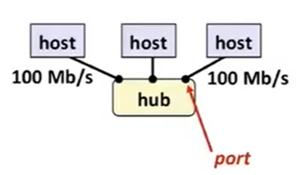
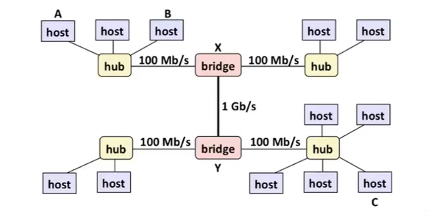
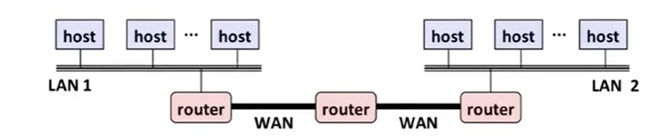
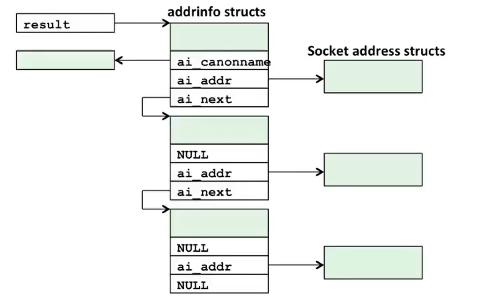
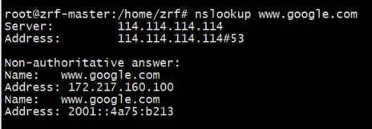
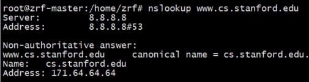
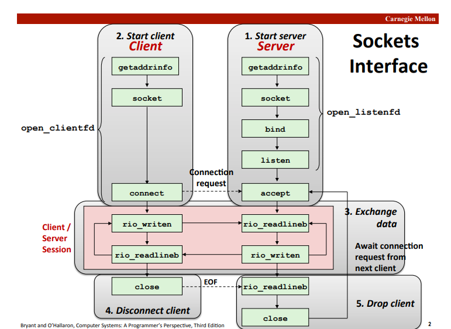

# 网络编程

## 概念

* LAN（Local Area Network）一个建筑或者一个校园内的小范围，由集线器（hub)和主机构成。（以太网）。集线器会广播别的主机发送的每个比特。

  

  

  bridge为网桥，不会广播，通过算法指定传送。

  

* WAN（Wide Area Network）一个国家或者世界的大范围，电话等

  

  

## 一些数据结构

### IP地址

```c
struct in_addr
{
	uint32_t s_addr;
}
//给字节排序，按照大小端方式，
#include<arpa/inet.h>
uint32_t htonl(uint32_t hostlong);//主机字节到网络字节顺序
uint16_t htons(uint16_t hostshort);

//ntohl//网络到主机字节顺序
//ntohs  
```


* IP地址：128.2.194.242=0x8002c2f2，左边是点十分进制

  ```c
  #include<arpa/inet.h>
  //p:presentation  点十分进制表示
  int inet_pton(AF_INET,const char* src,void* dst);//成功返回1，src为非法点十分制地址返回0，出错返回-1.
  const char* inet_ntop(AF_INET,const void* src,char* dst,socklen_t size);//成功返回点十分进制字符串，出错返回NULL
  ```

## 因特网连接

* 端口在客户端上是动态分配的，只在一定时间内有效，在服务器端是固定的。
* 一个客户端可以和一台服务器上的不同服务进行通信，即不同端口 同一个IP地址。

## 套接字编程

* 套接字地址结构

  ```c
  typedef struct sockaddr SA;
  //大端字节序
  struct sockaddr
  {
      uint16_t sa_family;//这是什么类型的socket  TCP/UDP/IPv6
      char	sa_data[14];
  }
  //可以把sockaddr_in看做sockaddr的一个子类
  struct sockaddr_in//特指IPv4socket结构，
  {
  	uint16_t sin_family; //AF_INET
  	uint16_t sin_port;
  	struct in_addr sin_addr;
  	unsigned char sin_zero[8];//置0,因为ipv4没有用到这个部分8字节
  }
  ```

### socket

```c
#include<sys/socket.h>
#include<sys/type.h>
int socket(int domain,int type,int protocol);

int clientfd=Socket(AF_INET,SOCK_STREAM,0);
//AF_INET指的32位的IPv4地址
//SOCK_STREAM 双向流连接，TCP连接
//
```

### bind（一个内核函数）

* bind是服务器上的一个特殊函数，bind告诉内核把addr中的服务器套接字地址与套接字描述符绑定起来。

```c
#include<sys/socket.h>
int bind(int sockfd,const struct sockaddr* addr,socklen_t addrlen);
int bind(int sockfd,SA* addr,socklen_t addrlen);
```

### listen

* 告诉内核这是一个服务器端的socket，用来监听。

### accept

* 表明这边已经准备好连接，可以接收连接请求。一直等待，直到有新的连接到达。他会返回一个新的描述符，用以服务器和客户端之间进行通信用。

```c
#include<sys/socket.h>
int accept(int listenfd,struct sockaddr* addr,int* addrlen);
int accept(int listenfd,SA* addr,int* addrlen);
```

### connect

* 建立一个与服务器端的连接(这里有个疑问，为什么这个函数要有第三个参数的结构体长度)

  ```c
  #include<sys/socket.h>
  int connect(int clientfd,struct sockaddr* addr,socklen_t addrlen);
  int connect(int clientfd,SA* addr,socklen_t addrlen);
  ```

  

### getaddrinfo（主机和服务的转换）

* getaddrinfo是一个新的C语言函数，查找一些信息并处理主机名和主机地址，所有端口协议和部分不同的结构体等。这个函数旧的函数（gethostbyname，getservbyname）相比，它同时适用IPv4和IPv6地址，并且让代码更加简单。 另一方面旧函数是在多线程出现之前设计的，有很多静态的缓冲区，写代码的时候必须格外注意。新函数虽然不能隐藏很多细节，但是在多线程的环境中工作更好。 还有一方面getaddrinfo尝试去模仿协议管理器，使其变得复杂。这个函数是可重入的。

  ```c
  #include<sys/types.h>
  #include<sys/socket.h>
  #include<netdb.h>
  int getaddrinfo(const char* host,const char* service,
                  const struct addrinfo* hints,
             struct addrinfo** result);//成功返回0，出错返回非0错误代码。
  /*
  	host:主机信息，可以是主机域名，也可以是点十分进制。
  	service：表明这是一个服务，比如IPv4的TCP服务，也可以是服务名比如http，也可以是十进制端口号。
  	hints（提示）：与此连接相关的其他信息
  	result：返回一个结果的指针，addrinfo结构体的指针,具体见下图
  	struct addrinfo
  	{
  		int	ai_flags;  //位掩码，具体含义见书
  		int ai_family;//socket中第一个参数
  		int ai_socktype;//socket中第二个参数
  		int ai_protocol;//socket中第三个参数
  		char* ai_canonname;//规范的主机名
  		size_t ai_addrlen;//套接字地址结构大小
  		struct sockaddr* ai_addr;//套接字地址结构
  		struct addrinfo* ai_next;//链表中下一个addrinfo
  	}
  */
  void freeaddrinfo(struct addrinfo* result);//释放
  const char* gai_strerror(int errcode);//返回错误消息
  ```

  



* 结果是一个链表的原因是因为有些域名不止一个地址，例如google有多个地址，这里谷歌有两个地址，所以会返回两条result。

* 

* 有些地址有规范名字比如如下，但是规范名字不会占用result中的一个结构体。

* 

  

  

### getnameinfo

getnameinfo和getaddrinfo是相反作用，把套接字地址结构转化成相应的主机和服务名字符串。代替gethostbyaddr和getservbyport

```c
#include<sys/socket.h>
#include<netdb.>
int getnameinfo(const SA* sa,socklen_t salen,//输入：套接字结构
				char* host,size_t hostlen,//输出：host
				char*serv,size_t servlen,//输出：server
				int flag);					//位掩码，修改默认行为
```


## 服务器和客户端流程



## HTTP

* HTTP请求
  * method URI version 
    * method:GET	POST	OPTIONS	HEAD	PUT	DELETE	TRACE
    * uri:统一资源标识符，是URL的后缀。URL必须包含主机名和资源的具体位置，但是URI只是这些信息的一部分或者全部URL。
    * version：http版本，1.0或者1.1.
  * header-name:header-data
    * 报头的格式，可以有多条。
    * 例如Host: www.aol.com	Host指示了原始服务器的域名，从而帮助代理寻找本地是否有副本。这是http/1.1中的内容。
  * 最后是一个空文本行，用来表示报头输入结束。

* 静态内容请求和动态内容请求