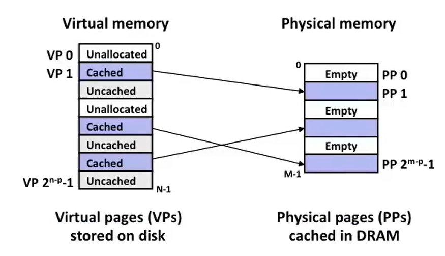
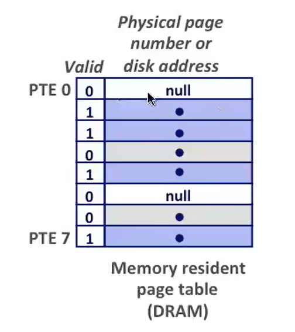
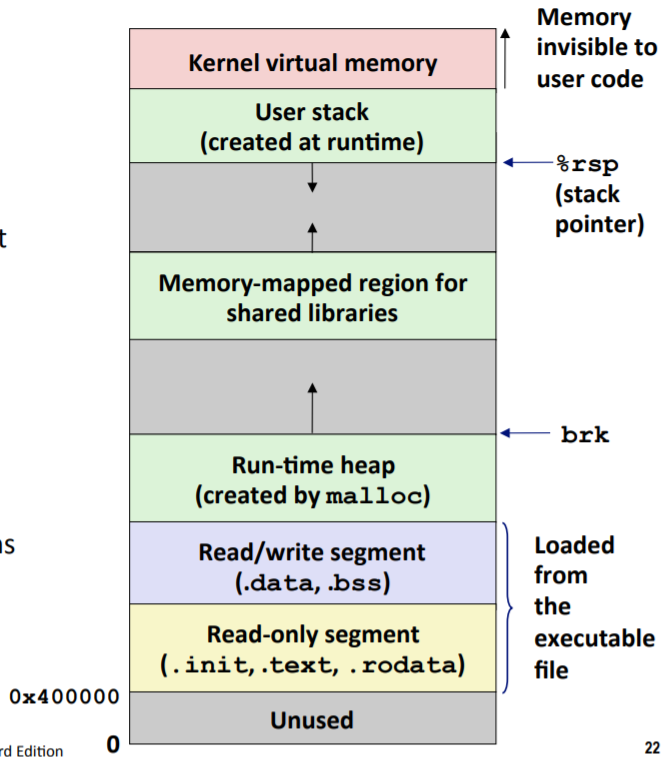
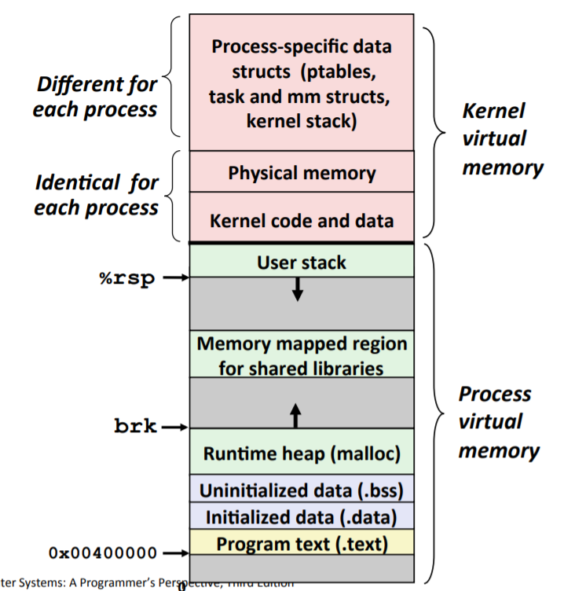
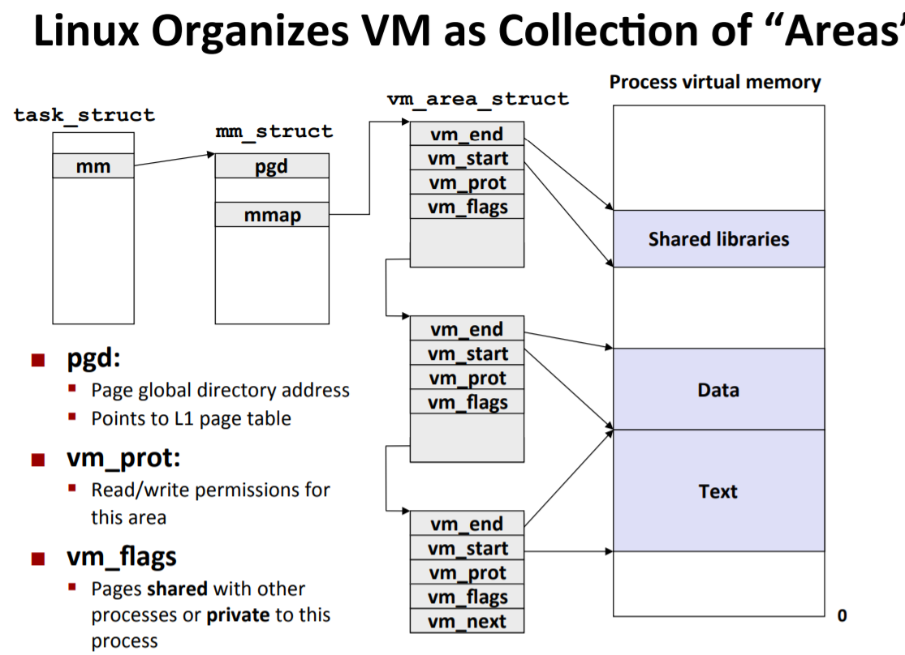
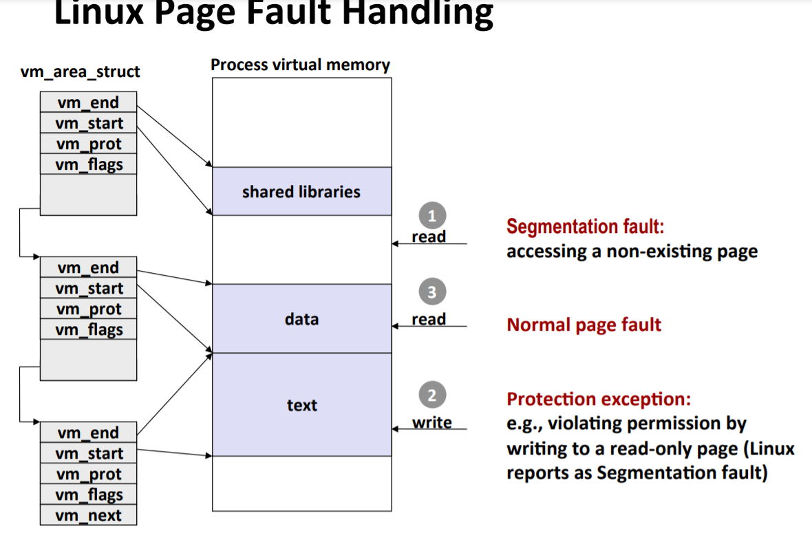
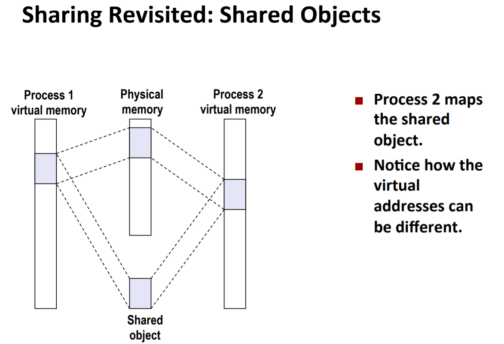
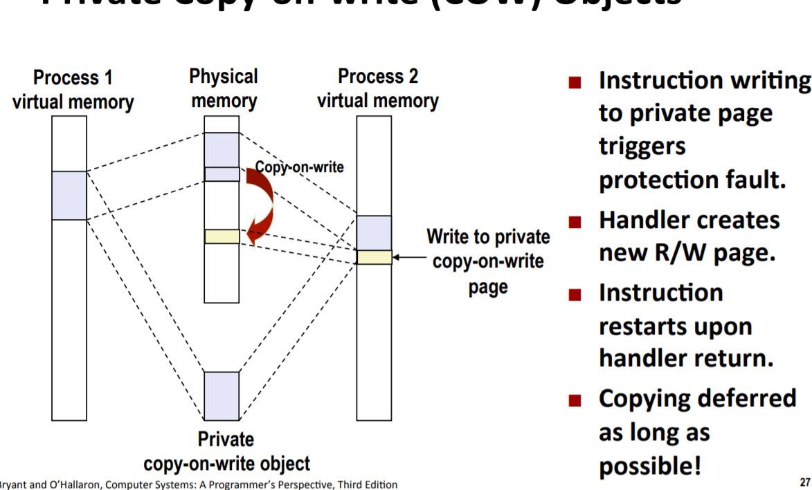
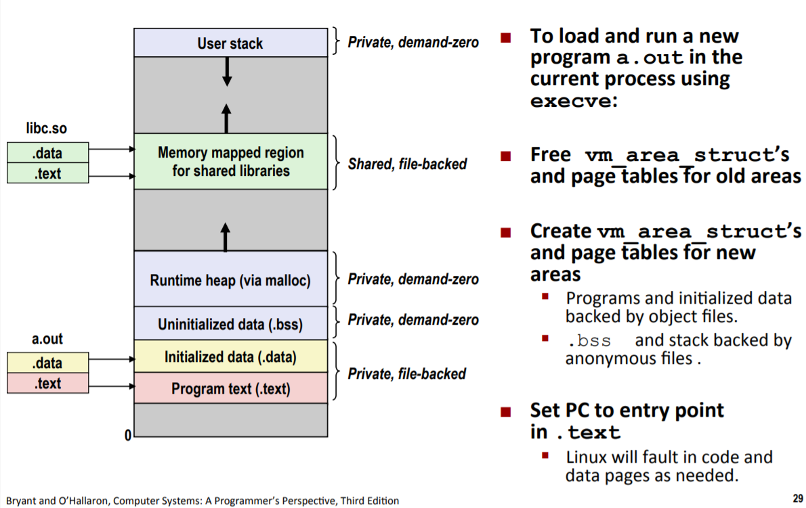

# 虚拟内存

### 几个概念

* 线性地址空间
* 虚拟地址空间
* 物理地址空间（物理主存用的DRAM，高速缓存用的SRAM）

### MMU（Memory Management Unit）

#### 使用MMU和虚拟内存的原因

1. VM as a tool for caching:虚拟内存使用DRAM作为存储在磁盘上的实际数据的缓存（在这里虚拟内存就可以看做是存储在磁盘上数据的DRAM缓存），从而可以更有效得使用内存（因为只需要将经常用的数据，根据局部性原理缓存起来，就可以极大得提高效率）
2. VM as a tool for memory management:大大简化了内存管理，因为每个进程的地址空间是固定的，堆栈，数据，代码等位置也是固定的，
3. VM as a tool for memory protection:虚拟内存允许我们创建受保护的私有地址空间；用户程序不能访问到内核的数据和代码等

### VM as a tool for caching



1. 虚拟内存是磁盘上的一些页，而DRAM是这些页的缓存，并且虚拟内存是全相联映射，每个虚拟页面可能被存到缓存中的任何位置，映射算法很复杂；
2. 同时不命中时的替换策略也很复杂（因为这是通过软件进行复杂的映射和替换，之所以可以很复杂是因为这点计算的时间和缓存不命中而从磁盘读写的时间开销对比起来，几乎可以忽略不计）；
3. 除此之外DRAM缓存采用写回磁盘的策略，尽可能地将写回磁盘的操作推迟。

#### 虚拟地址转换物理地址

同任何缓存一样，虚拟内存系统必须有某种方法来判定一个虚拟也是否缓存在 DRAM 的某个地方。如果命中缓存，那么虚拟内存系统还必须确认这个虚拟页存在哪个物理页中。如果没有命中缓存，那么虚拟内存系统必须判断虚拟页存放在磁盘的哪个位置，在物理内存中选择一个牺牲页，并将虚拟页从磁盘复制到 DRAM，替换这个牺牲页。

这些功能由软硬件联合提供，包括操作系统软件，MMU 中的地址翻译硬件和一个存放在物理内存中叫页表（page table）的数据结构，页表将虚拟页映射到物理页。每次地址翻译硬件将一个虚拟地址转换成物理地址时都会读取页表。`操作系统负责维护页表内容，以及在磁盘与DRAM之间来回传送页。`

#### 页表、页命中、缺页、分配页面

##### 页表

* 页表每个进程都有一个页表，由内核维护，是每个进程上下文的一部分。



* 页表由多个页表条目（PTE:Page Table Entry）构成的数组，前面是有效位，后面是对应的物理内存中的物理地址。

##### 页命中

* 虚拟地址通过MMU得知某个虚拟地址在页表中的哪个条目，同时根据这个条目可知该虚拟地址是在磁盘上的虚拟内存中还是在DRAM的物理内存中。如果在物理内存中就可以把页表中该条目具备的物理地址返回给MMU。

##### 页缺失

* 如果条目中显示在磁盘上，则触发一个缺页异常（异常控制流中的故障，可以被修复的成为故障）
* `（这里不太明白，以后看完操作系统再回来改）猜测可能是因为缺页，（MMU）触发异常（可能是其他硬件，不清楚是什么硬件），`然后把控制权转移给内核中的缺页处理程序的代码，代码选择要驱逐的页，如果该页被修改过则写回磁盘；把磁盘上的页拷到内存中来；然后更新页表条目；缺页处理程序返回时候，返回原来发生故障的指令，重新运行就不缺页了。

##### 分配页面

* 在页表中找到空的条目，分配新的内存页，并使得PTE中的地址指向这个磁盘上的新的内存页。

### VM as a tool for memory management



* 简化链接：因为虚拟的进程地址空间，能够让链接器提前知道每个全局变量的引用的实际虚拟地址，比如text段起始虚拟地址是0x400000.并且代码，数据和堆总是从一个相同的虚拟地址开始的，所以很好确定。
* 简化加载：加载器（execve）加载一个可执行的二进制文件，可以知道二进制文件中的代码、数据是多大（根据ELF文件特性），关键的是，加载器从不从磁盘拷贝数据到内存，仅仅是为代码和数据段分配虚拟页，并修改了页表的相应表项（把有效位置为0，然后把页表条目指向目标文件中的适当位置）。随后CPU需要用到数据或者指令的时候，内核才会开始调入数据到物理内存。（按需分配页）
* 简化共享：把不同进程的页表里面的某一项指向同一块物理内存，从而简化了共享。
* 简化内存分配：当调用malloc时，为进程分配虚拟页，然后通过页表映射到物理页，这些物理页没必要连续。（这个物理页可以在磁盘上，也可以在物理内存中）

### VM as a tool for memory protection

* 在页表中设置额外的位来表明权限，可读、可写、可执行（x86_64新加的位，用来防止代码注入攻击，32位没有 ）、用户态访问、内核态访问等等

## 地址翻译与地址转换

* 给定一个虚拟地址，通过地址转换成一个物理地址。
* 地址转换过程都会，就不写了。

### 注意

1.多级页表可以节约内存空间。原因如下：

* 首先每个进程有一个进程页表，这个进程页表映射了整个进程地址空间，注意是整个地址空间，即使有些地址空间并不在用，但是进程页表中仍然要分配相应的项，让他指向NULL（这是因为页表是完成虚拟地址到物理地址转换的必须结构，如果没有在使用的地址就不分配项了，那么那块虚拟地址都不存在了）。
* 其次，多级页表的第一级仍然是整个进程的空间映射，但是每一项映射的范围更大，一级页表每一项只映射4KB，多级页表可能每一项映射4MB，那么所需的表项就少了。另一方面，多级页表中除了第一级页表外，次级页表可以不存在（第一级页表没有相应的次级页表对应，第一级页表中相应的项为NULL），也可以不在主存（根据程序局部性原理，可以换入换出内存）。

2.如今分段机制已经过时了，因为有了进程的虚拟地址空间。具体分段机制看[博文](https://blog.csdn.net/u012489236/article/details/103661749)，所以自从x86-64起，除了在“传统模式”下，分段机制已被认为是过时的且不再被支持。虽然在x86-64的本机模式下仍然有分段机制的某些痕迹，但大多只是为了兼容，且它们不再具起到同样的作用，也不再提供真正的分段。

## Linux 虚拟内存系统

### 虚拟内存模型



* 其中的内核区有一块连续的页面为物理内存的映射（大小为系统中DRAM的大小），可以方便内核访问物理内存中的特定位置。

### Linux相关数据结构组织虚拟内存



* 其中vm_area_struct一般用红黑树组织，方便查找。

### Linux缺页异常处理

* 过程：首先CPU指令执行要读取一个虚拟地址，MMU翻译这个虚拟地址，通过页表查询发现PTE的有效位为0，会触发一个缺页异常，这个异常导致内核进入缺页异常处理程序，然后处理程序对地址进行检查。
* 处理程序检查地址：判断地址是否合法，通过在vm_area_struct进行查找，判断是否属于访问了一个不存在的页面导致段错误，对应图中1.
* 处理程序检查访问是否合法：随后判断是否有因为权限问题，例如写一个只读页面，如果有权限问题，则触发一个保护异常，终止进程，对应图中3.
* 全部正常之后：内核知道了这个缺页是对一个合法的虚拟地址进行合法的操作造成的，于是根据一定的算法选择替换一个物理内存中的，然后CPU重新执行缺页的指令，此时能够正常运行。对应图中2.




## 内存映射

内存映射指的是Linux通过将一个虚拟内存区域与一个磁盘上的对象关联起来，以初始化这个虚拟内存区域的内容。

* 内存映射的两种形式：1.映射到一个普通的磁盘文件。2.映射到匿名文件。
  * 磁盘文件：Linux虚拟内存系统中部分页面映射到了磁盘上的文件，比如可执行文件中的指令，但是这个过程仅仅是映射，并不实际把内容从磁盘拷到内存，只有当CPU第一次引用页面，则会发生缺页异常，此时才将内容拷入物理内存。当要分配区域比文件大小大时，就用0填充多余出来的区域。
  * 匿名文件：一个区域可以映射到一个匿名文件，该匿名文件由内核创建，内容全是二进制的0，CPU如果引用这样一个区域，则会通过一定的算法选择从物理内存中要换出的页，然后用0把该页内容覆盖，更新页表。此时仍然没有数据之间的传送。

### 共享对象

* 一个对象被映射到虚拟内存的一个区域，可以分为共享对象和私有对象。
* 共享对象：



当进程1映射了一个共享对象之后，进程二也想要映射这个共享对象，因为每个共享对象都是一个文件，有一个唯一的文件名，所以内核可以迅速判定进程1已经映射了和这个对象，并且物理内存中有相应的副本，所以进程2的页表条目可以直接指向这个副本。

* 私有对象：如果两个进程都映射了一个私有对象，物理内存中还是和共享对象一样只有一个副本，但是该副本对应的页表条目上设置为只读，并且结构区vm_area_struct中被标记为私有的写时复制。只要进程正常读该私有对象都没问题，但是当有一个进程要写这个私有对象时，那么这个写操作会触发一个保护故障，从而CPU进入故障处理程序，故障处理程序注意到保护异常是由于进程试图写私有的写时复制区域中的某些页面而引起的，他就在物理内存中创建这个页面的一个新的副本，更近写的那个进程的页表条目指向这个新的页面副本，然后把页表条目上权限改为可写。随后CPU重新执行写操作即可。

  

  

### fork

fork函数为创建一个子进程，当fork函数被调用时，内核为新进程创建各种数据结构，并分配一个唯一的PID。然后拷贝一份父进程的mm_struct,vm_area_struct，页表等，形成一份副本，并将这两个进程中的每个页面都标记只读，把vm_area_struct中的每个区域都标记成写时私有复制，任意一个进程要进行写操作时，会像上面所述那样写时复制。

### execve

当通过execve执行一个新的可执行文件时，它会进行如下步骤：

* 删除已存在的用户区域，即删除当前进程虚拟地址中的用户部分存在的区域结构和页表等。

* 映射私有区域：可执行文件中的代码被映射为.text区，数据被映射为.data区。把.bss区域映射到匿名文件（因为bss区内为未初始化的全局变量或者初始化为0的全局变量，a.out中包含了该区的大小），栈区和堆区都是请求二进制0（映射到匿名文件）的，初始长度为0.

* 映射共享区：如果可执行文件与libc.so等共享库链接，那么通过动态链接到这个程序，再映射到用户虚拟地址空间内的共享区域。

* 设置程序计数器PC：最后一件事是设置当前进程上下文中的程序计数器，使之指向代码入口点。

  

  

### mmap函数进行映射

* Linux进程使用mmap函数来创建新的虚拟内存区域，并把对象映射到这些区域中。

```c
#include<unistd.h>
#include<sys/mman.h>

void *mmap(void *start, size_t length,int prot,int flags,int fd,off_t offset);//映射成功返回指向映射区域的指针，出错则为MAP_FAILED(-1)
/*
start:映射区域的起始地址，指定为NULL则该地址由内核选定
length:区域大小
prot:映射区域的访问权限，即vm_area_struct中的vm_prot位，
	PROT_EXEC:可执行
	PROT_READ:可读
	PROT_WRITE:可写
	PROT_NONE:不可被访问
flags:表示被映射的对象为匿名对象还是私有对象还是共享对象。
	MAP_ANON:匿名对象，相应的虚拟页面是请求二进制0的
	MAP_PRIVATE:私有的写时复制对象
	MAP_SHARED:共享对象
*/	


int munmap(void *start,size_t length);//若成功返回0，出错返回-1.
```

## 动态内存分配

* 因为有些结构要在运行时才知道所需内存大小，所以需要动态内存分配。动态内存分配通过在堆上进行分配虚拟地址空间

### 分配器

* 显式分配器：应用分配和释放内存，系统不帮助释放。例如C中的malloc和free,new和delete
* 隐式分配器（垃圾收集器）：应用显示地分配内存，但是应用不释放，随后由系统负责释放内存。

### malloc和free

* malloc和free对堆中内存进行分配和释放

  ```c
  #include<stdlib.h>
  
  void *malloc(size_t size);	//成功则返回已分配块的指针，出错返回NULL，并设置errno。
  void *calloc(size_t nitems, size_t size);//nitems:要被分配的元素个数。size:元素的大小。与malloc不同点在于calloc会把内存初始化为0，malloc不会。
  void *realloc(void *ptr, size_t size);
  /*
  ptr -- 指针指向一个要重新分配内存的内存块，该内存块之前是通过调用 malloc、calloc 或 realloc 进行分配内存的。如果为空指针，则会分配一个新的内存块，且函数返回一个指向它的指针。
  size -- 内存块的新的大小，以字节为单位。如果大小为 0，且 ptr 指向一个已存在的内存块，则 ptr 所指向的内存块会被释放，并返回一个空指针。
  */
  
  void free(void *ptr);//ptr参数必须指向一个从malloc、calloc、realloc获得的已分配块的起始位置。但是并不释放指针本身，指针还是指向原来的位置。
  ```

  

* 除此之外还可以通过sbrk函数对内核堆顶指针brk进行操作来扩展或者收缩堆。

  ```c
  #include<unistd.h>
  void *sbrk(intptr_t incr);//若成功返回旧的brk指针，出错返回-1，并把errno设置为ENOMEM。
  //incr可正可负。
  ```

  

### 碎片

* 内部碎片：内部碎片就是已经被分配出去（能明确指出属于哪个进程）却不能被利用的内存空间；

  **内部碎片** 是处于 **（操作系统分配的用于装载某一进程的内存）区域内部** ~~或页面内部~~ 的`存储块`。占有这些区域或页面的进程并不使用这个 [存储](http://baike.baidu.com/view/87682.htm)块。而在进程占有这块存储块时，系统无法利用它。直到进程释放它，或进程结束时，系统才有可能利用这个存储块。

* 外部碎片：外部碎片指的是还没有被分配出去（不属于任何进程），但由于太小了无法分配给申请内存空间的新进程的内存空闲区域。

  外部碎片是处于任何两个已分配区域或页面之间的空闲存储块。这些存储块的总和可以满足当前申请的长度要求，但是由于它们的地址不连续或其他原因，使得系统无法满足当前申请。